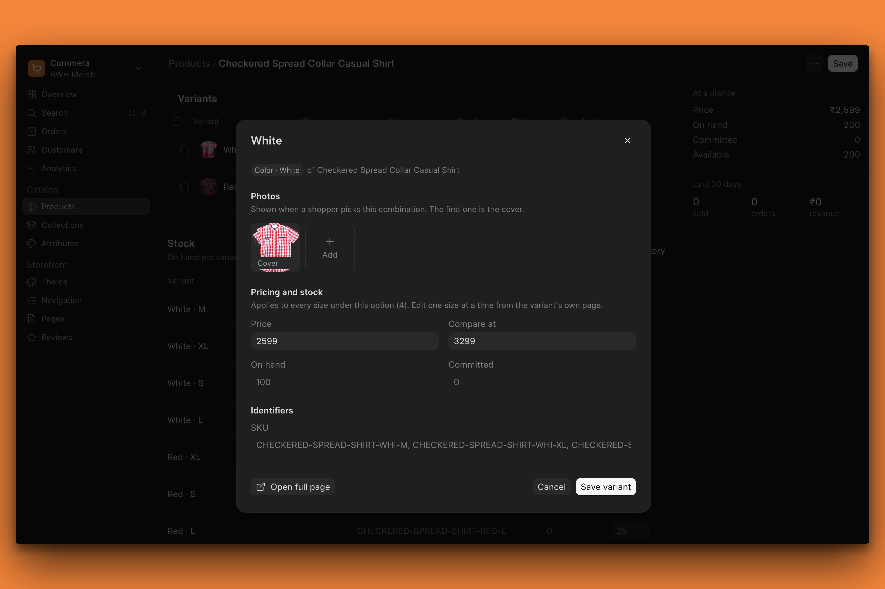
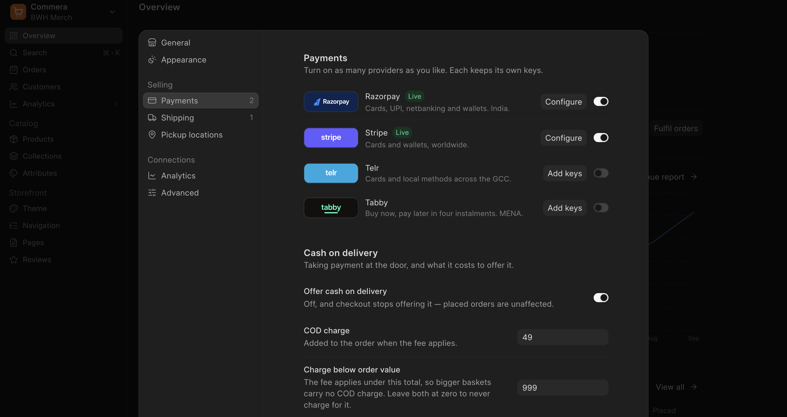

The dots have finally started to connect. What started as a simple custom eCommerce app for a client has now become the base for a **solid eCommerce platform** backed by ERPNext!

<figure>
  <video controls playsinline preload="metadata" poster="/media/commera-now-in-beta/commera-demo-reveal.jpg" src="/media/commera-now-in-beta/commera-demo-reveal.mp4" title="Commera demo"></video>
  <figcaption>Commera Teaser</figcaption>
</figure>

Today we are releasing [a beta version](https://github.com/bwhtech/commera/releases/tag/v16-beta.1) of Commera. And of course it is open [source](https://github.com/bwhtech/commera)! You can find the setup guide in our documentation [here](https://docs.bwh.tech/commera). We are working on making it comprehensive as we go.

### The Ask

The ask from *you* right now is **feedback**! Install it, use it, try to break it, and report issues via GitHub or just email us (developers@bwh.tech).

For the **developers**, try to build your own payment gateway, theme, or shipping integration and see if you can cleanly extend **Commera** via custom apps!

If you have a use case or a customer who wants to set up an online store backed by ERPNext, we are happy to help you set it up on a call and answer any queries. You can book a call using [this link](https://cal.com/rl0007/commera-onboarding).

### Themes

Every online store is different and needs to be unique. Instead of building a few hard-coded themes or variables, **we built a theming engine** powered by Jinja. You can build a custom Frappe app that brings its own theme (can extend the base theme or could be completely new!) backed by Commera's extensibility.

We will also have **Frappe Builder backed themes** before the stable release.

### Merchant Dashboard

Crafted for eCommerce management.

Built with Frappe UI and lessons we learned by working on an extensive eCommerce platform on ERPNext. For example, we have tried to make it super easy to create and manage variants. You can easily update stock, bulk upload images, etc.

### Integrations & Apps

We want to take on Shopify (I know, I know, long shot, but nothing worth doing is easy IMO). 

In order to do that, we will need a solid ecosystem (*within* the Frappe Ecosystem 🤯) of integrations and apps. Hence, from Day 1 we have thought of making it easy to extend Commera via custom apps. Right now payments and shipping integrations are their own apps with the ability to add your own payment gateway and shipping integration just by extending a base class and creating a DocType!

* [Documentation for BWH Payments](https://docs.bwh.tech/bwh-payments) 
* [Documentation for BWH Shipping](https://docs.bwh.tech/bwh-shipping)

Apps are coming next!

### Relationship to Webshop, ERPNext

Commera is built on top of ERPNext and I think that is one of the core USPs. You are not just getting an online store but it is backed by standard workflows in ERPNext that give you proper accounting and stock management.

As for Frappe Webshop, we already have many features that Webshop doesn't and the plan is to sunset Webshop altogether.

### Up Next

* Guest Checkout (currently sign up is needed to checkout)
* Better theme customisations ([sneak peek](https://github.com/bwhtech/commera/pull/168))
* Frappe Builder backed themes (also bring Bob AI based storefront design!)
* Ability to add your own custom Frappe UI pages in the merchant dashboard
* Communications as a plug-n-play app (e.g. send invoices on WhatsApp)

You can check the public roadmap [here](https://github.com/orgs/bwhtech/projects/15/views/1?pane=issue&itemId=243689660&issue=bwhtech%7Ccommera%7C101).

Feel free to ask any questions or share suggestions you might have in the comments below.

Join the [Commera community on Telegram](https://t.me/commera_by_bwh) to follow along, get help and share feedback.
