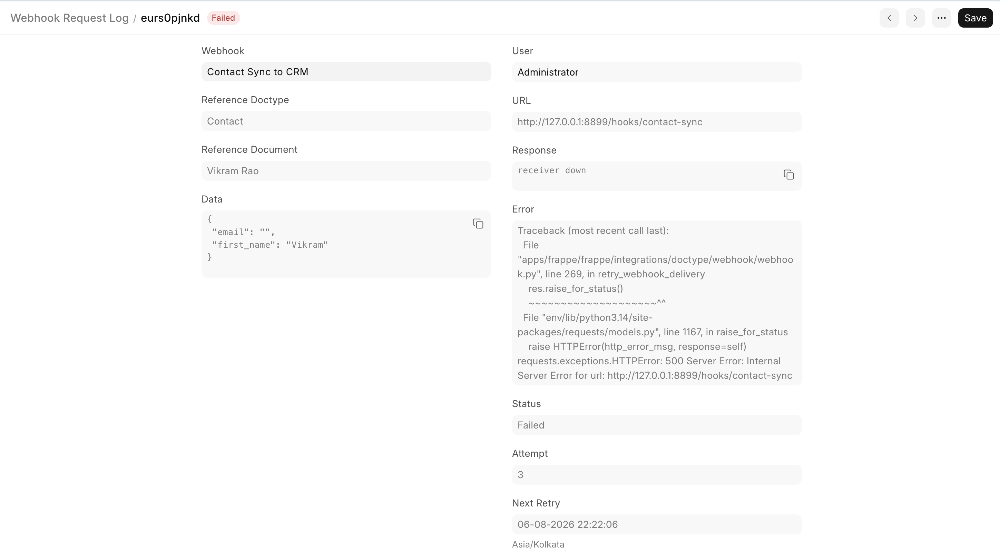
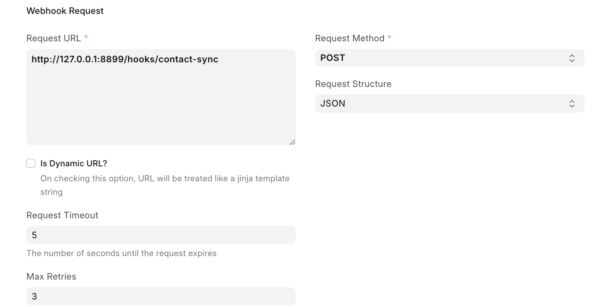

Your webhook receiver goes down for two minutes. Frappe fires an event at it, gets a connection error, tries again for five seconds, gives up, and throws the event away.

> Not delayed. Not parked somewhere for later. Gone.

That was the real behaviour until recently, and it is fixed in `develop` now ([#38913](https://github.com/frappe/frappe/pull/38913)). This is the story of how, including the part where I built the whole thing wrong first, and a one-line bug I tripped over by accident that ended up teaching me more than the feature did.

A Webhook in Frappe Framework is a doctype. You pick a document type, a document event such as `after_insert` or `on_submit`, a URL, and the shape of the body you want sent. From then on, whenever that event fires on that doctype, the framework builds the request and sends it in a background job. It is how a Frappe site pushes an event into n8n or an external service, without anyone writing code.

> A few words show up throughout this post, so here they are up front:
>
> - **Worker** is a background process that picks jobs off a queue and runs them, one at a time.
> - **Enqueue** is putting a job in that line for a worker to pick up later.
> - **Cron** is a schedule that runs a job at a fixed interval. Each run is a **tick**.
> - **Backoff** is how long you wait before trying again, and how that wait grows with each attempt.
> - **Sweeper** is a job on a cron that looks for rows that have come due and does something with them.
> - **HMAC signature** is a hash of the payload made with a shared secret, so the receiver can check the request came from you and nobody changed it on the way.

All of it assumes the request actually arrives. Here is the delivery loop that was supposed to make sure of it:

```python
for i in range(3):
	try:
		r = requests.request(...)
		r.raise_for_status()
		log_request(...)
		break

	except requests.exceptions.ReadTimeout as e:
		log_request(...)

	except Exception as e:
		log_request(...)
		if i < 2:
			sleep(3 * i + 1)
			continue
		if webhook.webhook_docevent == "workflow_transition":
			raise e
```

Three attempts, with `sleep(1)` and `sleep(4)` in between. The whole retry window is about five seconds, and a background worker spends all five of them asleep, holding a slot nobody else can use.

Five seconds is plenty for a dropped packet. It is nowhere near enough for a deploy, a restart, a rate limit, or a receiver having a bad minute; which is, unhelpfully, every outage that actually happens.

Then there is the `ReadTimeout` branch, which is quietly the worst part. It never sleeps and never re-raises. So a receiver that hangs instead of refusing gets all three attempts fired at it back to back with no gap at all, each one waiting out the full timeout against a receiver that is plainly not answering. And if a workflow transition was waiting on that result, it never finds out anything went wrong.

There was also nothing to look at afterwards. Every attempt wrote its own Webhook Request Log row, so you got three unrelated rows, no attempt number, and no way to answer the only question anyone actually asks: *is this thing still going to be delivered or not?*

## My First Attempt

My first attempt was the same idea with a knob on it.

The issue ([#21063](https://github.com/frappe/frappe/issues/21063)) asks for a configurable number of retries. Fine. Add a `max_retries` field, let people set it to whatever they want. And while I'm in here, `sleep(3 * i + 1)` is a strange curve, so swap it for `sleep(min(2 ** i, 30))`. Proper exponential backoff. Configurable. Done, surely.

Then I went to [Hussain](https://github.com/NagariaHussain), who proposed this idea, and asked what kind of retry the issue was actually asking for. The answer was one line: in a later job, not immediately. Along with a pointer to [Svix](https://github.com/svix/svix-webhooks).

So that patch was a dead end. It was frustrating at first, but then I realized something. Everything I wrote was still retrying inside the same job, and **every `sleep()` call kept the worker busy the entire time.** If I increased `max_retries`, one failed endpoint could tie up a worker for several minutes. And the kind of delays that actually make sense are often minutes or even hours, so using `sleep()` wasn't really an option anyway.

## Research

So I stopped writing code and went reading, for a couple of months: Svix's source, how Stripe and GitHub describe their delivery guarantees, AWS EventBridge, and a pile of posts from teams who learned this the expensive way. The finding that surprised me most is that almost nobody uses real exponential backoff. They use a fixed, hand-picked schedule. Svix's is 5 seconds, 5 minutes, 30 minutes, 2 hours, 5 hours, 10 hours, 10 hours. Those aren't a formula; they're a judgement call about what outages look like in the wild. Most are over in seconds. The ones that aren't tend to last hours.

**The whole detour cost me an implementation, and it was one question wide.** "Retry" is a compressed word and I unpacked it into the loop I already knew how to write, which is the version of the feature that was easiest for me to imagine rather than the one being asked for.

## The Redesign

Retrying later has one hard consequence: the retry cannot live in a variable, because the process that would hold it is long gone by then. It has to live in the database.

So the Webhook Request Log stopped being an attempt record and became a delivery record. One row per event, carrying its own state.

| Status | Meaning | `next_retry` |
| --- | --- | --- |
| `Delivered` | Receiver accepted it | empty |
| `Failed` | Awaiting a retry | set to the due time |
| `Exhausted` | Terminal; no further attempts | empty |

The rule that keeps this tidy: `Failed` always means "a retry is scheduled". There is no failed-and-forgotten state. Anything that will never be tried again is `Exhausted`, whether it ran out of attempts, hit a request it couldn't even build, or belonged to a webhook somebody has since disabled. That leaves the sweeper with one query and no special cases.

<figure style="max-width:880px; margin:1.75em auto;">



<figcaption>One delivery, three attempts in, waiting on the fourth. The payload it will send is the one sitting on the row.</figcaption>
</figure>

The schedule is Svix's, minus the 5 second entry, because Frappe's scheduler works in roughly one minute steps and a 5 second promise it cannot keep is worse than not making it:

```python
RETRY_SCHEDULE = [5 * 60, 30 * 60, 2 * 3600, 5 * 3600, 10 * 3600, 10 * 3600]


def get_next_retry(attempt: int):
	delay = RETRY_SCHEDULE[min(attempt - 1, len(RETRY_SCHEDULE) - 1)]
	return add_to_date(now_datetime(), seconds=delay)
```

The `min(...)` clamp means a webhook set to more retries than the schedule has entries keeps going every 10 hours instead of falling off the end of the list. With the default `max_retries` of 3, a delivery is tried at 0, +5m, +35m and +2h35m, then marked `Exhausted`. Set it to 0 and retries are off entirely: one attempt, and whatever happens is final.

<figure style="max-width:760px; margin:1.75em auto;">



<figcaption>Max Retries sits alongside the existing timeout, and defaults to 3.</figcaption>
</figure>

The first attempt still happens in the same background job it always did. Only the failure path changed:

```python
except Exception as e:
	frappe.logger().debug({"webhook_error": e, "try": 1})

	# A workflow transition needs the webhook result now, so fail it instead of deferring a retry.
	if webhook.webhook_docevent == "workflow_transition":
		log_request(..., status="Exhausted")
		raise

	if cint(webhook.max_retries) >= 1:
		log_request(..., status="Failed", next_retry=get_next_retry(1))
	else:
		log_request(..., status="Exhausted")
```

`workflow_transition` is the one event that refuses to be deferred, and it gets to keep refusing. The transition is waiting on that answer right now. A retry two hours later is not an answer; it is a document stuck in the wrong state while someone stares at it wondering what happened. So that path stays synchronous and raises, and you find out immediately. It is a deliberate behaviour change: it used to get three attempts over five seconds before raising, and now it gets one.

Everything else goes to a sweeper on the five minute cron, which picks up every delivery whose retry time has passed.

One more decision worth calling out: a retry replays the payload stored on the log row instead of rebuilding it from the document as it looks now. If an event fires and somebody edits that document during the outage, the receiver should still get the event that happened, not a tidied-up version of it. **A webhook is a record of something that occurred at a moment in time.** Rebuild the body on retry and you have quietly turned it into a poll.

## The Best Thing I Learned

The best thing I learned from this feature, I found by accident.

I was testing against a local receiver and flipped on webhook security, which signs the payload with an HMAC and sends it in a header. First attempt: signature there, correct, receiver happy. Retry: garbage.

The signature was being stored as raw `bytes`. When the log row got written, `frappe.as_json` turned those bytes into an array of integers. The first request had already been built and sent by then, so attempt one never noticed. Every retry read that mangled value back out of the row and sent a header the receiver could not verify.

The fix is a `.decode()`:

```python
signature = base64.b64encode(
	hmac.new(
		webhook.get_password("webhook_secret").encode("utf8"),
		frappe.as_json(data).encode("utf8"),
		hashlib.sha256,
	).digest()
).decode()
```

Here is the part I keep thinking about.

That bug was old. It shipped, it sat there, and it was completely harmless, because nothing in the codebase ever read that header back. The value went into a log row that only humans ever looked at, and humans do not verify HMAC signatures. It could have lived there forever.

> The bug was already there. Retries were just the first thing to read it back.

It changed how I look at new features now. Most of what I build ends up reading data the system has already been writing for years. **And a value that has only ever been written is a value nobody has checked.** It got saved. It looked fine in a form. That was as far as anyone ever took it. The moment your code reads it back and does something with it, whether it is correct becomes your problem.

I would never have found this by reading the diff. The only reason it surfaced is that I sat there watching a real receiver reject a real retry. Which is the other half of the lesson: the bugs that hide in stored data don't show up in review, and they don't show up in unit tests you wrote from the same assumptions as the code. They show up when something downstream finally has an opinion.

> There is a [test](https://github.com/frappe/frappe/blob/f7676b78792d1cd3018520087103793e28ebef1b/frappe/integrations/doctype/webhook/test_webhook.py#L517-L529) for it now.

## The Sweeper

The sweeper has to stay out of its own way.

The obvious version is a loop: select the rows that are due, send each one, move on. It works right up until the receivers are slow, which is the exact situation a retry sweeper exists for.

Picture a hundred due deliveries against a receiver taking five seconds to time out each time. The tick is still grinding when the next one fires. Both ticks pick up overlapping rows, and the receiver gets the same event twice. **Delivered twice is a worse failure than delivered late.**

So the tick never delivers anything itself. It only enqueues:

```python
def retry_failed_webhooks():
	"""Enqueue a delivery job for each webhook whose scheduled retry time has passed."""
	due_logs = frappe.get_all(
		"Webhook Request Log",
		filters={"status": "Failed", "next_retry": ["<=", now_datetime()]},
		fields=["name", "webhook"],
		order_by="next_retry asc",
		limit=RETRY_BATCH_SIZE,
	)

	for log in due_logs:
		job_id = f"webhook_retry::{log.name}"
		if is_job_enqueued(job_id):
			continue

		# ... resolve the webhook's queue

		frappe.enqueue(
			"frappe.integrations.doctype.webhook.webhook.retry_webhook_delivery",
			log_name=log.name,
			job_id=job_id,
			queue=queues[log.webhook],
		)
```

Three things are doing work here. The tick only enqueues, so it finishes in milliseconds no matter how slow the receivers are. `RETRY_BATCH_SIZE` caps one tick, so a backlog drains over several instead of dumping itself into the queue at once. And the deterministic `job_id` is the concurrency guard: if a retry for that row is still queued or running, the next tick walks past it.

The other way to do this is a database-level claim, either `FOR UPDATE SKIP LOCKED` or an intermediate `Retrying` status written before dispatch. I went with the job id, and the reason is recovery. A worker that dies holding a `Retrying` row leaves it stuck in a state nothing else will move it out of, so now you need a second job to clean up after the first one. A row left `Failed` with a past due time heals itself; the next sweep picks it up, because picking up due rows is the only thing the sweep does.

Counting it up afterwards, the retry is barely any of the work. `get_next_retry` is two lines. Everything that took months was what retrying drags in behind it: state that has to outlive the process, a payload that has to stay frozen while the world moves on, a guard against the same delivery going out twice, one path that must refuse to defer at all, and an old field that nobody had ever read back.

So if you are adding retries to something, I don't think "how do I try again" is the question worth sitting with.

> It is "what can now happen twice".
