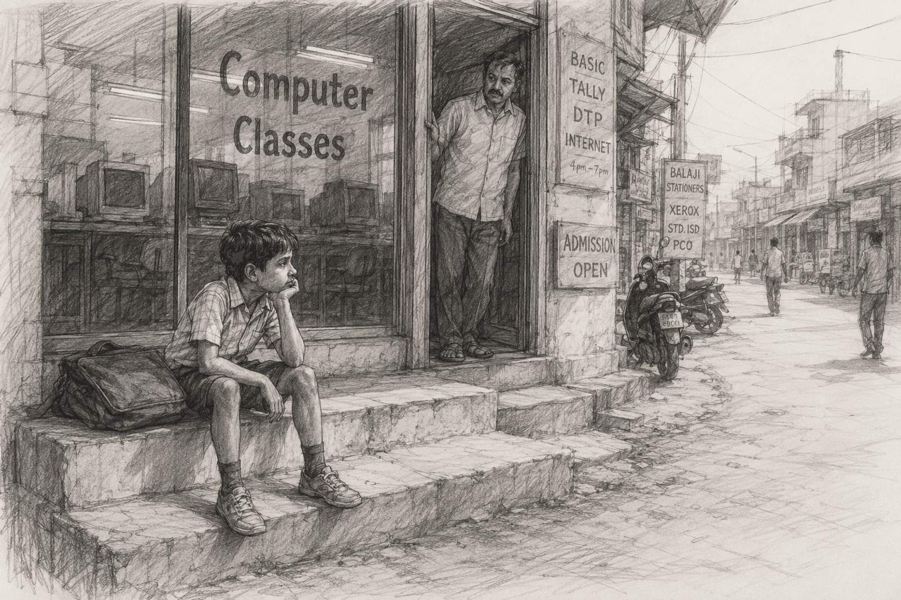
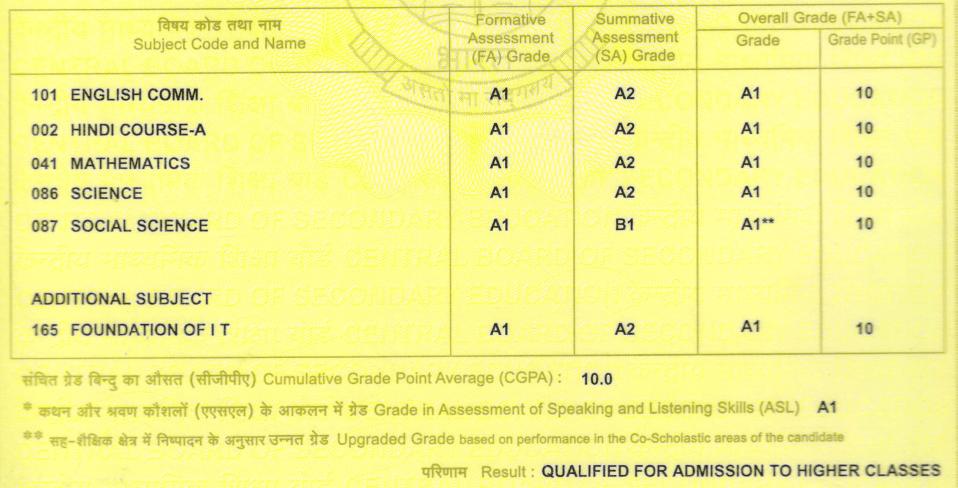
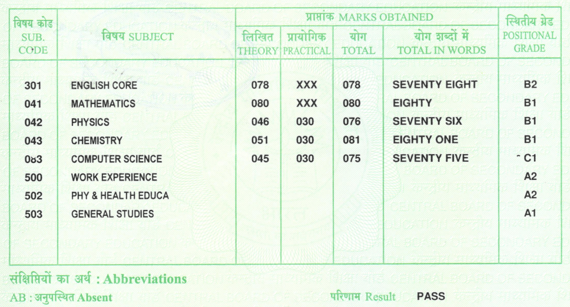
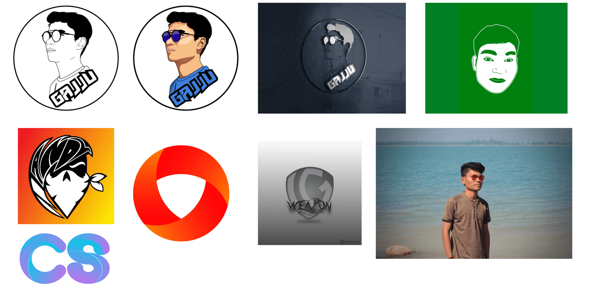

I have never written a blog before. So this is my first one. And I decided to make it about the only thing that has stayed with me since class 4: the computer.

It has been a long ride. A tutor who pulled my hand into a lab, a terrace at 12 AM, a report card that broke me, and a lot more. Let's start!

## The First Computer

My story starts in class 4.

That was the year I first saw a computer. A big CRT monitor one. I was in a Hindi medium school back then. My big brother was in class 7 and he was attending computer coaching classes. I still don't know why he joined it. The class was 1.5 hours, right after school.

And I had to wait outside for all of those 1.5 hours.

I was just a kid, so I did kid things. Counting the people I saw that day. Counting the cars. Looking here and there. That was the routine. Papa would come after the class, and we would go home. This went on for around two weeks. I never once put a foot inside that door.

Then one day the tutor noticed me.

He asked me who I was waiting for. I pointed my hand toward the lab and said, *"Papa aayenge, bhaiya padh rha hai."* (Papa will come, my brother is studying inside.) He asked, *"Games khelte ho?"* (Do you play games?) I said, *"Nahi."* (No.)

He said, *"Aao kuch dikhata hun."* (Come, let me show you something.)

He pulled my hand and took me inside the lab, where everyone was busy with their practicals. He switched on a computer and started some space war game (I really don't remember the name of it 😅). But it was cool. He played one or two rounds. He told me to watch his hand on the mouse and his fingers on the keyboard. Then he helped me play it myself.

After that, I played that game for 20 minutes daily. But only if nobody was sitting on that computer. I would check first. If it was free, I played. If not, I simply walked out and sat outside again. No complaints, no anger, nothing.

That is how I started sitting among them. And that is where I learned my first computer things. Mouse, keyboard, CPU, monitor. Windows XP. How to open Paint and draw.

## Maths and CS were my subjects

By class 9, I had switched to a CBSE school and we finally had Computer as a subject.

By then I already had a computer at home. And I was good at it. I knew a lot of the functionality already, mostly because I played a lot of games. So I loved that subject. Maths too. Those two were mine.

My scores were good, and I managed to keep them good while still playing games. Then class 10 came and I got serious about boards, so I joined coaching early, in April, before the session even started.

My brother was doing coaching at another place, and I used to go with him. That bhaiya (his tutor) was also a tech guy. He was really good with computer graphics stuff, Photoshop, Illustrator and all. That looked amazing to me.

### The Gmail and the Lumia

Our principal told us to create a Gmail account to register for the boards.

Now here is the funny part. I had a computer at home, but it had no internet. No Wi-Fi, and I had no idea how you would even connect it. Nobody at home had a smartphone either. So I had never actually used the internet in my life. To me a computer was a machine that ran Paint and games. That is it.

That bhaiya was the one who explained the whole thing to me. What the internet is. What Gmail is. And that you could buy a data voucher, 100 MB for 20 rupees.

So I bought a second hand phone from him, a Nokia Lumia 520. Yes, a Windows phone. Honestly it was a pretty amazing one, totally different from everything else.

I created my Gmail on it that night. The next morning I was the first student in school with a Gmail account. And this is the one I made: `gajjug004@gmail.com`. 4 was my roll number back then, so 004 is still sitting in most of my accounts even today. My [GitHub](https://github.com/gajjug004) too 😁

### 12 AM to 6 AM

That phone opened up the internet for me. I was on an Idea SIM, one of the big telecom operators in India back then. And do you know what Idea gave you? Unlimited 2G/3G internet between 12 AM and 6 AM for a 7 rupee voucher.

So here is what I did. Every day I bought a 10 rupee recharge coupon from the mobile shop. At night I activated the plan. Then I scrolled YouTube and downloaded Photoshop and Illustrator tutorials.

This thing got crazy. I slept less. My routine was: sleep before 10, alarm at 12, then climb up to the terrace. The terrace was the only place where 3G network came. Then download and watch till 6 AM.

I had already got the software from that bhaiya and installed it on my computer. So I started editing photos, doing colour grading, learning layers, cutting images, blending them. I was good at it.

Then the mid sem exams came and I had to pause. My father was strict about scores, so studies came first. I did not stop Photoshop completely, I still opened it in my free time. But it moved to the back seat.

In the last one month, our syllabus was already done. So I downloaded sample papers and model papers from the internet and just practised. I revised and solved a lot of questions till the exam arrived.

And here is the result:

10 CGPA. The only one from my school branch to score it, and my name went up on the banner board of the main branch.

## Class 11 Broke Me

Then I joined Kendriya Vidyalaya, one of the central government schools in India. New school, new environment, zero friends. Everybody was a stranger.

I took PCM with CS. And that is where the real struggle started.

All the subjects were new. And the teachers were strict. Very strict. Daily homework, daily classwork, and every other day you had to submit both notebooks for checking. For every subject.

Looking back, I don't think the teachers were the problem. They were running the system they were handed, and that system measured you by how many notebooks you filled, not by how much you actually understood. Keeping up with all of it and studying on top of it was too much for me.

I could not understand things on my own, so I joined coaching. It was 15 km away, so bus. And the timing was insane:

- School was 15 km away too, so I reached home around 4 PM
- Ate, got 25 minutes, then left for coaching
- 5 to 6 physics, 6 to 7 chemistry, 7 to 8 maths
- Reached home by 8:30, freshened up and had dinner in 30 minutes
- Then sat down for school homework till 12 AM, sometimes later
- Woke up early to revise

That left me 1 or 2 hours of actual study, at max. And that was nowhere near enough for those subjects.

So my grades dropped. Day by day.

Class 11 gave me the worst report card of my life. For a lot of people that score would be fine. But I was the guy who scored a perfect 10 CGPA a year ago, so it felt like falling off a cliff. I was broken. My confidence was gone.

And then they called a parents teacher meeting.

I was so afraid of my father. The teacher told him, *"Aapka ladka padhta bhi hai ghar me? Ye kya marks hain?"* (Does your son even study at home? What kind of marks are these?) I had barely passed most subjects. The only good score was CS. My father had never heard anything like this about me before. He looked straight into my eyes, and I could see the disappointment.

Man, I was dead.

The one thing that saved me was a person. Anas. He became my only friend in that school, and honestly I survived because of him. He was in the exact same situation. He was a topper in his previous school too. Same story, same crash. Anas, thank you.

## The Comeback

My father gave me a clear warning. This time it is the 12th board. Fix it.

So Anas and I sat down and made strategies. How do we score good in the boards? Nothing was working. Because there was simply no time left for the one thing that mattered: studying. Everything went into coaching and homework and maintaining notebooks.

Then, with 2 months and 1 week left before the finals, I did something drastic.

I left all my coaching classes.

I had already failed chemistry twice in pre boards. 19 out of 70. I had barely passed maths and physics. So we sat again for a week and looked for a way out.

That is when we found out that CBSE follows patterns in their papers. We downloaded the last years' question papers and ordered some Arihant unsolved books. We found this on a Reddit thread, where a lot of students said it actually worked for them.

So we solved and revised only those. Only the book and the past papers. Nothing else. For 2 months we were fully focused.

And it worked.

The result was not great, but we had stopped drowning. We both got 78%.

Here is the result:

I got my highest marks in chemistry. The same chemistry I was failing in pre boards. I think I took that one a little personally 😆

One sad part though. While I was busy saving physics, chemistry and maths, I made some silly mistakes in the CS paper. It cost me marks in the one subject I was actually good at. But who knows. It just happened.

One good thing from these two years: I learned C and C++. I wrote a lot of code, solved a lot of questions, made a lot of small programs. That gave me a solid base in programming.

## School Over, What Now?

Everyone from the maths stream runs the JEE race. Anas and I could not make it. And we knew that reality very well.

So we did research again. Which course, which colleges, and what it costs. We did not want to burn years on a JEE attempt when the chances were low and the cost was high. We thought about it financially. The only thing we were genuinely good at was the computer. So BCA, then MCA. Also no physics and no chemistry in the course. Two birds, one stone.

### The Photoshop Detour

Remember the Photoshop thing I paused in class 10?

It never fully left. I used to design things when I was alone, and after those hectic school days I did not want to talk to anyone anyway. Here are a few designs I made back then:

Then I researched it properly and found out this could actually be a career: Graphic Designer. So I spent some time learning it seriously. Photoshop, Illustrator, Lightroom, After Effects. It was genuinely fun.

Then reality hit. Graphics rendering needs a heavy GPU and a lot of RAM. I had a dual core CPU with 2 GB. I knew it would not hold up. But I still tried.

This is a clip I made in After Effects back then. It took 7 hours to render.

[Here it is on YouTube](https://www.youtube.com/watch?v=l6zJRFPxW3k).

## BCA and the Web

Then I went to Bilaspur for my Bachelor in Computer Applications.

That is where I found web development. And I dropped graphic design completely and put everything into this one skill.

HTML, CSS, JavaScript. I did this for 3 years. I used to build vanilla components with plain HTML, CSS and JavaScript. Buttons, cards, forms, carousels, navbars, nav components, input boxes, headers, footers. I learned CSS styling and animations, and form validation in JavaScript. All of it by hand (no AI to prompt back then, you read the docs, broke things, and fixed them yourself 🙃).

I was not doing it for money. I never even thought about money back then. I did it because it was fun and I always want to learn new things.

I also learned PHP in these years, which was good for building logic and dynamic web apps.

There was no reference, no mentor, and I mostly stayed alone. No new friendships. Then covid hit. I spent 1 year in Bilaspur, then went back home when the lockdown started and stayed home for around 1.5 years. After that I returned to Bilaspur and finished the course.

By this time I was mature enough to know that marks and degrees are just records. They will not hand me anything. So I stayed average with scores and focused only on skills.

## MCA and Django

After BCA, I gave the entrance exam and got into a Bilaspur university for my MCA.

Here the core subject was Python. And it was interesting. Compared to C and C++, I had to write much less code, and it was fast to work with.

So Python became my new fun thing. In free time I wrote code in it and understood the core concepts on my own, before the course even finished. I also practised SQL queries and Python on HackerRank.

Three semesters passed. Then it was internship time.

So I researched again: what can I do with Python as a career? And that is when I found Django.

I sat consistently and learned Django properly. Built some simple CRUD apps. And it was really cool. You define a model class, write your columns as Python variables, run the migration command, and it creates the database for you. Felt magical.

I loved that framework. I got very good at defining models, then views, then URLs, because I learned the standard way to structure things from the start.

## First Internship: Yashvitech

I built my resume with these skills, made a LinkedIn profile, and started applying.

For 3 months, no response.

So I listed down a few companies in Raipur and called them directly. The very first one, Yashvitech Solutions, gave me a full stack internship.

It was unpaid. And they were also charging me 8k for the training. But it was fine for me. I just wanted to apply my skills on a real project and learn React along the way. So I packed my bags, went to Raipur, and joined.

On the first day I was put directly into a class where React basics and installation were being taught. I sat there for 2 or 3 days learning React, HTML and CSS.

Then I told one of the tutors that I already knew Django backend. He wanted to test me, so he gave me tasks. Build a CRUD application for students. Add constraints like unique and primary keys. Serialize the models. Add a simple login system.

I finished all of it the same day. They were surprised, not just by the speed but by how structured the code was.

### Backend for Everyone

There was no live project at that time. Everyone there was a student working on their college project.

So I helped all of them. I built and structured their backends. Every project I was put on had a ready, structured backend by the next morning. Things that took them weeks or months, I was finishing in a day. I also helped them build the logic for their projects.

### BillZap

Then one day a tutor came with a SaaS idea. A billing application, later named BillZap.

The client should be able to make sales invoices, purchase invoices, quotations, delivery notes and so on, just like MyBillBook, Zoho Billing or Tally. He had built a small MVP, not fully working, but the project structure was there.

I was assigned to build the backend with him, along with 2 other students who knew a bit of React. He handled and guided both frontend and backend.

Then he met me personally, because the other tutor had told him I was helping every student with their backend. He asked me where I learned all this and how much I knew. I told him everything.

And then he taught me things I had never heard of. Multi tenancy, which back then I learned is supported properly by Postgres. How to write custom middleware. How to add logging into files so you can track and debug when production breaks.

I also learned Git and GitHub there, and got my first look at AWS deployment. Alongside all this I picked up Docker and Next.js on my own.

We worked on it for 3 to 4 months, and then the project went live. We got 12 clients within Raipur they said, since they had someone doing the marketing.

I wrote the whole API layer for that project. It took me 1 or 2 days to build the APIs fully working and tested. Then it took weeks for the frontend folks to design and consume them 😆

One day everyone asked me to take a class and teach them backend. So I made a PPT and taught them how to start and structure a backend project. The feedback was good, even from the tutors.

### Chat with PDF

For my final semester I did my project completely on my own. A RAG based AI system: Chat with PDF.

I saw a YouTube video that showed how to create a vector DB for context and query it efficiently with LLM models. So I built a Django wrapper around it to show it off as a web application, and wired it up with a locally running Llama model.

It worked with about 95% accuracy.

## The Gap Year I Did Not Plan

Then both the internship and my MCA ended.

I had learned a lot and had real hands on practice on a real project. So I went back home.

And then my father met with an accident.

My brother was a teacher, posted in another place. So I had to take care of the family. My father's lower backbone was broken a bit, so he could not stand at all and was on complete bed rest. It took around 4 to 5 months for him to recover.

I stayed home for all of it. In between I kept applying for internships and jobs on LinkedIn and Naukri(dot)com. Then he recovered fully and I could finally focus on my own thing again.

And the job hunt was frustrating.

I applied to many companies. I started cold DMing on LinkedIn. I DMed **more than 200 HRs** and people! No response. These things take time, and I did not want to sit at home any more. So I called everyone in my contact list and asked for a referral from anyone they knew.

Got nothing.

Then I went to a campus placement event in Bhilai and got selected in an interview. The offer was: 12 months of free training, but you come to Bengaluru, and based on your performance we will connect you with the companies we are tied up with. My family needed me at that time after what had just happened, so I could not go that far. I also thought about it financially. So I dropped it.

Then I looked at other software companies in Raipur, and found Codenicely. I talked to the HR directly and asked if there was any vacancy for a backend developer. She scheduled an interview.

## Second Internship: Codenicely

I cleared 3 technical rounds, 1 HR round, and a final call with the CEO.

And then guess what they offered. 3k per month for the internship, and 20k full time after that.

After all that struggle and four rounds of interviews. Man, I was so disappointed.

I told the HR honestly that 3k would not cover rent and food in a new city. We settled at 5k for 3 months, then 8k.

I discussed it with my brother. He said no. What is a 5k stipend? He told me to apply for the computer teacher vacancy at Aatmanand School instead. Easy to get, and the salary would be above 30k.

But I had zero interest in teaching. I had worked on my skills, and I wanted to use them.

So I made the decision myself. I signed the offer letter and joined Codenicely on 3rd June 2025 as an intern.

It was a hard decision. But there has always been this belief inside me: I can do it. I can do it by myself. I don't need anyone. I can handle this.

### Day One

I was very nervous on my first day. A lot of people around me. New place, new everything. How do I manage all of this?

I was assigned a buddy. For the first few weeks I got tasks and assignments from him and he reviewed everything. All of it was Django backend work, which was good news for me, because I had already worked on many Django projects. Designing models, structuring objects, writing APIs, serializing them, I was comfortable with all of it.

The feedback was good. So the CEO scheduled a meeting with me and my buddy, and asked how I was doing and whether I was ready to be put on a project.

### The AI Chatbot Project

Now the CEO knew I could handle real work, so they put me on a project that was completely new to me. An AI one.

We had to build a chat system for a client. They already had a backend, plus a legacy software that the backend was built on. Using their knowledge base and those APIs, I had to build a chat system where admin and administrative people could talk to the system.

The system had to do two things. Answer from the knowledge base. And trigger APIs based on intent: GET APIs to pull real data, PATCH to update status, POST to create resources.

There was one constraint. I was not supposed to build it from scratch. I had to research which platforms already provide this kind of facility.

So I did the research, came up with one or two options, wrote a research paper for it, and reported everything back with my recommendation on what would work for this project.

I worked on that project for 1 to 2 months and built the system. It was good, to an extent. I gave it my 100%, and the system did about 90% of what they wanted.

But there were a lot of tough meetings back and forth, and in the end it did not work out for them. They dropped the idea and said they would pick it up later.

That was that.

### n8n and the Handover

Then I was put on another project outside my domain. A workflow that had to be built in n8n, which was very popular at the time. I worked on it for around a month and got it working.

After that I handed the project over to a new intern and gave her all the n8n related KT. She took it forward, and I moved to guiding and mentoring her.

### Orrish

Finally, after months, I was assigned a project where I could actually work on a backend system with my team lead. And my buddy was my team lead.

The project was Orrish, a loan management system for an NBFC.

One day our manager called us into her cabin and asked the team lead to give me the KT for the project.

He gave me the KT in 5 to 10 minutes. That was it 😅

He gave me an overview, explained what an NBFC is and what Orrish does. Then he asked me to set the project up locally, gave me access to the staging server, and told me to go through the whole flow from the start, one by one. Then he gave me the task list. I completed them and got them reviewed by him. Mostly building the APIs the client needed.

Then one day they decided to make it multi tenant. And they did not want to rewrite it from scratch.

So I had to make it multi tenant without touching the current production state, and in a way that we could onboard new NBFCs on top of it. As the backend developer, I was given the responsibility, with one frontend engineer working alongside me.

I worked another 3 months on this. And I actually did it. The system was almost ready by the time I put in my resignation. Only the subscription part and some third party services were left to integrate.

Yes, I resigned, for some personal reasons. But great learning and great building experience.

By that time I was managing work well enough to do DSA after office hours. So I practised consistently and prepared for the next stage while I was still in my notice period. I kept a 50 day streak on LeetCode.

## How BWH Happened

One day I got a message from a friend from NIT.

He told me about a company called BWH, sent the JD and the apply link, and said the requirement was for a Python and Django developer. He felt I had a good understanding of it, so I might have a chance.

He messaged me in the morning while I was at office. After office I came home, sat down on my bed immediately, opened my laptop, and updated my resume. Then I applied, and I filled the "why do you want to join?" section sincerely.

Surprisingly, it was the last day to apply.

And then I got a revert. Shivam (HR) called me directly and asked if I could join a quick call. I said yes and joined the meet. Hussain Bhaiya, Rahul Ji and Shivam Ji were all on it. I told them about myself and the projects I had worked on.

I had also done some research on the company, what they do and the open source work they do. I had once tried applying to Google Summer of Code (GSoC), but I did not have enough knowledge at that time. So I shared that interest too.

They liked it and wanted to proceed to the next round. I asked them whether I would get an intern or a full time offer, since I had applied for both. They said it depends on the next round.

The next round was coding and technical. I was prepared. I answered most of the questions, and I answered them honestly. I did not lie about anything. I could do the DSA questions too, though I got stuck on a few.

I don't know how it looked from their side. But I did my best and I was honest from the start.

Then I got the call from the HR at BWH.

Selected. Full time.

What. I got goosebumps. I did not expect that. And I did not expect the salary either.

It was 10x.

## BWH

First, thank you. To Hussain Bhaiya, Rahul Ji and Shivam Ji, for choosing me for this role.

I joined BWH in the middle of January 2026. I also had to move to Jagdalpur, which is far from home.

It has been 7 months now. I have grown in engineering and in communication. I learned a new framework, Frappe. And honestly, I like it more than Django. It is great for building complex applications quickly.

I also got certified. So you can call me a certified Frappe developer now. Here is the [proof](https://school.frappe.io/api/method/frappe.utils.print_format.download_pdf?doctype=LMS+Certificate&name=afovtp6a6f&format=FS%20Certificate) haha.

And the best part: I finally got to contribute to open source. Real contributions, to the Frappe Framework itself, the same framework I use every day at work. Remember that GSoC attempt I gave up on because I did not know enough? It came back around. You can see all my merged PRs across the Frappe org [here](https://github.com/search?q=org%3Afrappe+is%3Apr+is%3Amerged+author%3Agajjug004&type=pullrequests).

I also got the chance to go to Mumbai for Build 2026, the tech event organised by Frappe. That was so much fun.

I am comfortable with everyone here now. Everyone is polite, and everyone is excellent at what they do professionally. I admire all of them.

And some words for Hussain Bhaiya, Founder and CEO of BWH. He is very inspiring, and a great tutor and mentor. I have learned a lot from him, and there is a lot still pending. All the growth I found in this short period is because of him. So a big thanks from the depth of my heart.

Thanks to BWH for this life.

## In the End

That was it. My journey.

One thing stayed with me from the very beginning: the computer.

From a game on a CRT monitor, to a terrace at 12 AM, to APIs in production. So I chose the computer for my entire life.

And that is how I became a computer engineer ✌🏼

If you read the whole thing, thank you, seriously. If any part of this felt like your story too, I would love to hear it. Reach me on [LinkedIn](https://www.linkedin.com/in/gajju004/), on [GitHub](https://github.com/gajjug004), or just drop a mail at gajjug004@gmail.com. Yes, the same one from class 10 😁
