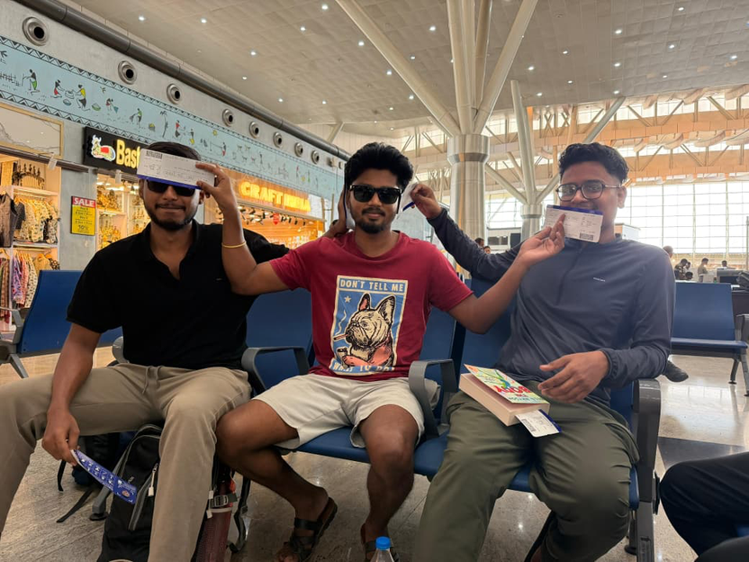
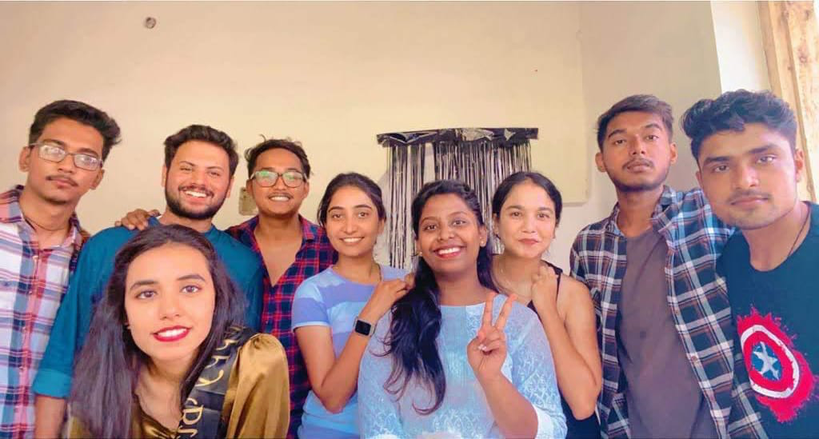
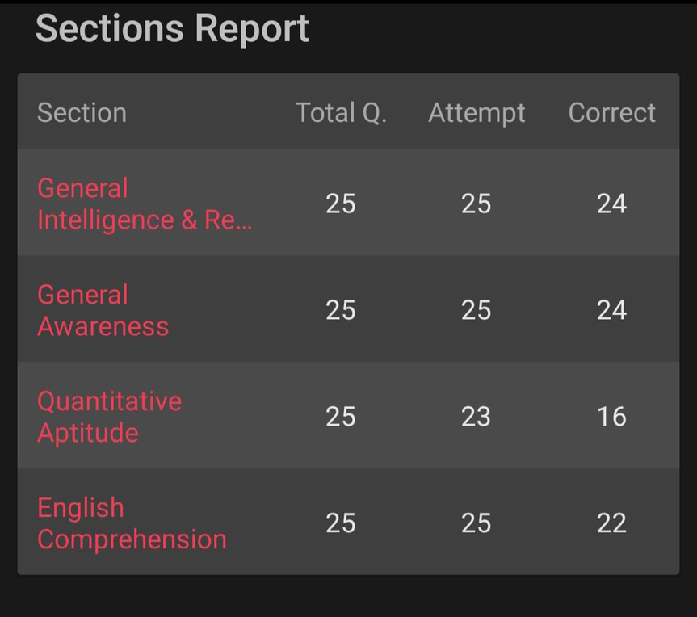
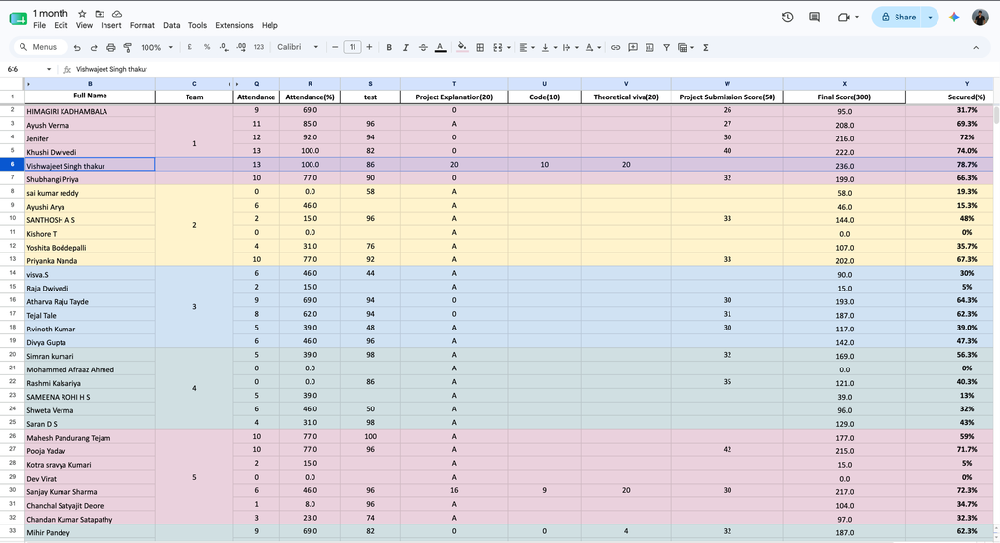
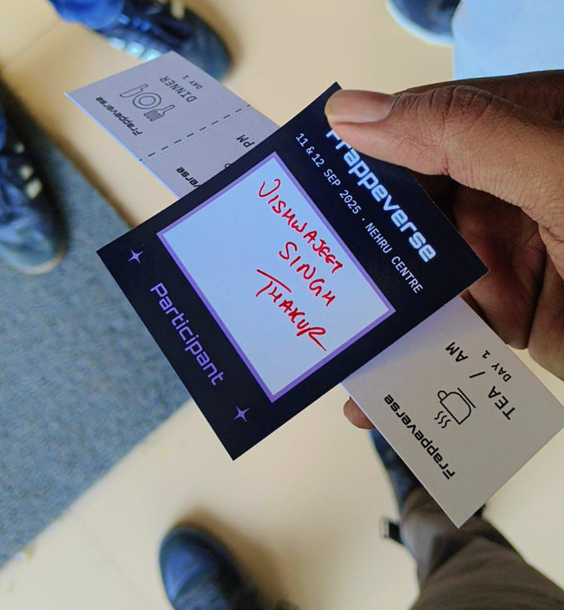

Everyone has a different story of how they got into tech. Some people have been coding since school. Some built apps as teenagers. Mine was completely different. I feared computers.

I was an average student in school. I spent most of my time playing, watching cartoons, and just enjoying life. I was never the student who topped the class or dreamed of becoming a software engineer.

After finishing 12th, I appeared for CG PET. I never even thought about giving JEE because I already knew it wasn't for me. When the results came, I got around a 7000 rank. It wasn't good enough to get a government engineering college, so I decided to move on and joined BSc instead.

Honestly, life was good. I enjoyed my first year of college, made new friends, and got comfortable there. Before I even realised it, one whole year had passed.

Then one of my school friends, Bhavesh, who was already studying in a Government Engineering College, kept insisting that both me and Milan(another friend) should give PET one more try. We weren't interested at all. We had already accepted where we were. But he didn't stop convincing us.

Finally, we agreed, mostly because for his happiness.

<figure style="max-width:500px; margin:1.5em auto;">

<figcaption>Gandhiji ke 3 Bandar</figcaption>
</figure>
A month before the exam, he himself taught us at his home. We studied together every day, and somehow everything clicked. Then the results came. I secured good marks. It was the highest rank among my classmates. I even received a scholarship, so my college fees were completely waived. My friend also got a good rank, and both of us joined the Government Engineering College in our hometown.

## Choosing IT

At that point, I wanted to choose Mechanical or Civil Engineering because my friend was already there. But my father suggested that I should take **Information Technology** instead.

But I didn't even like computers.

Growing up, we didn't have a computer at home. During a presentation in class 8th I made a silly mistake in front of the class and from that time, I was always scared of computers. If something unexpected happened on the screen, I immediately thought everyone would laugh at me. Because I don't know what to do if something happens. That fear stayed with me for years.

Still, I chose IT. Because my father wanted it so again for someone else's happiness I took the decision. But these all decisions were steps for how I became a software developer.

## College

College gave me some of the best friends I have today. We always joked that one day we'd work together. Back then, it sounded childish almost like a dream. But today, three of us actually work together, and maybe one or two more will join us in the future.

<figure style="max-width:500px; margin:1.5em auto;">

<figcaption>College group</figcaption>
</figure>

The funny thing is that while my friends were busy preparing to become software developers, I had completely different plans.

I wasn't interested in programming at all.

My only goal was somehow getting the degree and preparing for government exams, especially for SSC CGL. During our college years, almost six semesters were conducted online because of COVID, so I barely learned programming seriously.

Also the studying I was supposed to do during college actually started after college ended.

## The SSC CGL Attempt

For the next few months, I prepared only for SSC CGL. I collected every resource I could find from YouTube, solved mock tests every day, and genuinely believed I could clear it on my first attempt.

**I liked General Science. Maths was good. English didn't worry me much, and Reasoning was my strongest point.**

<figure style="max-width:500px; margin:1.5em auto;">

<figcaption>My mock results</figcaption>
</figure>

I had even planned my exam strategy before entering the exam hall. I knew exactly how many minutes I would spend on each section and which section to attempt first.

But exams don't always go according to plan.

Reasoning took much longer than I expected. By the time I reached Maths, only around fifteen minutes were left. I had twenty-five questions to solve, but I could attempt only fifteen before time ran out. I couldn't even get the time to see those 10 questions.

When the results came, I had missed the cut-off by just four marks.

**Those four marks hurt.**

## Jobs With No Time to Study

The next attempt was a year away, and I didn't want to sit at home waiting. So I decided to take a job and continue preparing alongside it.

I joined an NBFC. The salary was good for my hometown, but the office was around 35 kilometers away from my hometown. Every day started early in the morning. I had to travel a long distance by bus, return home in the evening completely exhausted, and by the time dinner was over, I had no energy left to study.

I kept telling myself that things would improve after getting transferred to my hometown.

After six or seven months, I finally got the transfer.

Nothing changed.

The workload became even heavier.

Since I finished my work faster than most people, I was given more responsibilities and eventually became the branch team lead. Seniors praised my work and even told me I could become a regional team lead if I continued like this.

At first, it sounded exciting.

Later, I realized those compliments mostly meant more work.

Again, I wasn't getting time to study.

Eventually, I left that job.

I tried another one, hoping the workload would be lighter.

It wasn't.

After just two months, I left that one too.

## The Turning Point

For the first time, I stopped and seriously asked myself what I actually wanted from life.

On one side was my dream of clearing SSC and joining MEA. On the other hand, I saw my college friends doing well in software development. They were learning, growing, and building things.

For almost a month, I thought about nothing else.

Then I finally accepted something that changed everything.

**I couldn't keep one foot in two different boats.**

Government exams required years of patience, and software development required complete focus. If I wanted to become good at something, I had to choose one path.

That day, I decided to let go of my government job dream and started learning programming seriously.

**Ironically, the subject I hated the most was about to become my career.**

## Learning to Code

Programming has always felt impossible to me. Every time I tried learning, I stopped at loops, if-else statements, or pattern questions. I never understood how people built actual applications from those basic concepts.

I tried learning from many YouTube channels, but nothing really clicked.

Then I found the [Sheryians Coding School](https://www.youtube.com/@sheryians) Youtube channel.

Their teaching style felt different. It didn't feel like a classroom. It felt like an elder brother casually teaching his younger brother. For the first time, programming started making sense.

I learned HTML, CSS, JavaScript, React, and some Python basics. More importantly, I started building projects.

That's when I realised something important: **tutorials teach you concepts, but projects teach you programming.** So instead of jumping from one course to another, I started building small frontend projects. Each one taught me something new and gradually built my confidence.

## Getting the Job at BWH

Then came April, and two important things happened.

The first was that I got an internship at [Zidio](https://www.linkedin.com/company/zidio-development/) . To be honest, I still don't know whether it was a regular internship or some kind of training program because there were around 40–50 students with me. We were divided into teams of eight, and each team had one month to build a complete e-commerce website. Throughout the month, mentors regularly reviewed our progress and guided us whenever we got stuck.

This was the first time I had worked on a real project with a team. Until then, all my projects were solo. I also got a little better understanding of Git and how developers collaborate while building software together. It wasn't just about writing code anymore it was about communication, planning, and solving problems as a team.

The second thing that happened in April turned out to be even more important.

I met [Hussain.](https://www.linkedin.com/in/buildwithhussain/)

It wasn't actually our first meeting. I already knew about him through my college friend Shivam. He had told me that Hussain and him were planning to start a software company in our hometown, Jagdalpur. The moment I heard that, I thought, What could be better than learning and working from my own hometown?

When I met Hussain in Kerala Restaurant, we only had a short conversation. I didn't tell him that I wanted to join his company. Honestly, I didn't think I was good enough yet. Instead, I asked him a simple question.

"What should I do to become a good programmer?"

He gave me a few suggestions about what I should focus on. I noted everything down and started working on those areas as soon as I got back. Looking back, that small conversation gave me a much clearer direction than months of watching random tutorials.

Meanwhile, my internship was coming to an end.

At the end of the program, every team had to present their project to the mentors. They evaluated everyone individually, and I ended up getting the second-highest score in the entire batch.

I was happy, but there was also a funny mistake behind that result.

**I could have finished first.**

The project was supposed to be submitted individually as well as by the team. I thought only one team member needed to submit it, so I never uploaded my own copy. Because of that, I lost fifty marks and missed a ₹15,000 stipend.

<figure style="max-width:900px; margin:1.5em auto;">

<figcaption>Zidio internship scores</figcaption>
</figure>
Missing it because of such a small misunderstanding hurts.

But after thinking about it for a while, I realized something.

Money comes and goes. The experience of building that project, working with a team, and presenting it confidently was worth much more. It was an expensive lesson, but a lesson nonetheless.

After the internship ended, I had only one goal in mind.

I wanted to get a job.

Shivam had already told Hussain about my Internship, and after some time, Hussain called me for a small interview.

I was nervous but excited.

He asked me questions about web development and software concepts. I still remember one of them.

"He asked me about Server-Side Rendering?"

I had absolutely no idea.

That interview reminded me how much I still had to learn.

Even though I couldn't answer every question, I showed him the projects I had built in my internship project, a dairy website, and a gym website. I think those projects spoke louder than my answers. I had spent a lot of time making the frontend look clean and polished without relying on AI, and I believe that left a good impression.

<figure style="text-align:center; margin: 1.5em 0;">
  <video controls src="/media/how-i-became-a-developer/dairy-gym-project-demo.mp4" style="max-width:500px; width:100%; height:auto; border-radius:8px; display:block; margin:0 auto;"></video>
  <figcaption style="font-size:0.9em; color:#666; margin-top:6px;">Dairy website</figcaption>
</figure>
I also told him honestly that I wanted to become a frontend developer because backend development still scared me.

But BWH wasn't looking for frontend developers.
You need to be a full-stack developer to work here.

They gave me a chance.

They asked me to build an Invoice Management application using Django. The idea was simple. Django's structure is quite similar to the Frappe Framework, so this project would help me learn the basics before moving further.

For the next two weeks, I learned Django from scratch and built the application.

When I submitted it, [Rahul](https://www.linkedin.com/in/rl0007/) reviewed the project carefully.

There were quite a few problems.

My URLs weren't structured properly, and the project didn't follow Django's best practices. Instead of accepting it, they asked me to rebuild the entire application from the beginning.

For a moment, I felt disappointed.

After spending so many days on it, hearing "start again" wasn't easy.

But they also shared learning resources and told me not to rush. They wanted me to understand the framework properly instead of just finishing the assignment.

So I went back, studied everything again, and rebuilt the application from scratch.

About two weeks later, I returned to the office with the new version.

This time, the feedback was completely different.

They wanted me to try deploying that project too, but I stuck at one point because my frontend was on react and backend on Django then Rahul helped me with deploying. I think they were more happy by seeing the UI again. I had recreated frappe's list view & form view for Invoice.

Even today, I believe that due to that they have selected me.

## Joining BWH

I have been told before officially starting, you have to spend some more time learning the Frappe Framework and built a couple of practice projects, including a Library Management System and the Airplane app. Which will help me in becoming familiar with the framework before working on real-world applications.

Then, on 14 July, my journey at BWH officially began.

I was the fifth member of the team. Along with two other new joiners from NavGurukul, I started my journey with a mix of excitement and nervousness.

In the beginning, Hussain gave us small tasks to learn. We try to use it and learn.

Then a few days after joining, Hussain asked me to start contributing to open source. He told me that if I wanted to become a better developer, I shouldn't limit myself to company projects. Contributing to open source would expose me to different coding styles, real-world problems, and reviews from experienced developers.

So I gave it a try.

My first contribution was to the Frappe HRMS. I still remember how excited I was when my first [pull request](https://github.com/frappe/hrms/pull/3396) got merged. Then came the [second](https://github.com/frappe/wiki/pull/413) one. Then the [third](https://github.com/frappe/wiki/pull/415).

Three pull requests merged in just three days.

**I was on cloud nine.**

For someone who had struggled to understand loops and variables just a few months earlier, seeing my code accepted in an open-source project felt unreal. It gave me confidence that maybe I was actually becoming a developer.

After that, I started picking up issues from the Frappe Wiki as well. Along with fixing bugs, I also spent time triaging issues, verifying bug reports, and helping organise the repository. It was a different kind of learning. Instead of just writing code, I was understanding how large open-source projects are maintained. We were even paid by Frappe for doing some of that work, which made the experience even more rewarding.

Eventually, we were offered the opportunity to actively work on improving the Wiki project. For someone who had only recently entered the software world, it felt like a huge milestone.

## Frappeverse

Then came one of the most memorable experiences of my journey so far Frappeverse.

<figure style="max-width:500px; margin:1.5em auto;">

<figcaption>Frappeverse, Mumbai.</figcaption>
</figure>

It was my first international tech conference, held in Mumbai.

Until then, my world was limited to YouTube tutorials, documentation, and my laptop. Walking into a conference filled with developers from different countries completely changed my perspective. I attended talks, listened to experienced engineers share their knowledge, and met people who had built products used by thousands of users.

It genuinely felt like my mind had expanded.

For the first time, I could clearly see where I wanted to reach. It wasn't just about getting a job anymore. I wanted to become someone who could build great software, and be part of the global developer community.

## Real Projects, Real Lessons

After returning from Frappeverse, reality hit us again.

The two other trainees who had joined with me were let go because they weren't meeting the team's expectations.

Seeing that happen was honestly scary.

I remember thinking, "If I stop improving, the same thing could happen to me."

Instead of making me lose confidence, it pushed me to work even harder.

Around the same time, BWH received a project from an NPO. Hussain felt it would be the perfect opportunity for me to learn, so he asked me to work on it with him.

This was my first real client project.

Unlike my previous projects, there was no room for shortcuts. Real people were going to use this software. If something broke, it wouldn't just be a bug in a demo project it would affect someone's work.

Hussain first helped design the overall structure of the application. We discussed the DocTypes, the data flow, and how different parts of the system would interact. Once the foundation was ready, he handed over most of the implementation to me.

Whenever I got stuck, he would guide me without simply giving away the solution. The team's philosophy was something they often joked about in Hindi:

"Paani m phek k dkhte hai. Tair liya to theek, nhi to dubne se pehle bacha lenge."

 As a beginner, it sounded terrifying I needed the handholding.

But later, I realized it was one of the best ways to learn.

Within about ten days, we had completed most of the project. The client wasn't ready to go live yet, so the deployment was postponed for a few months. But they were so happy with our work that they immediately gave us another project.

**As Hussain says, the reward for good work is more work.**

The second project was even bigger, with a strong focus on frontend development, so naturally it landed on my desk. Around the same time, another client project also arrived. Suddenly, within just two or three months of joining BWH, I was working on three real-world applications at the same time.

That third project turned out to be the one I learned the most from, and the one I ended up spending the most months working on. The client was AevyTV they run video editing cohorts, and thousands of real users would register through the platform we built for them. So, I couldn't just write the code and walk away I set up alert mails and kept monitoring the system every hour, making sure no real user ever ran into a problem while registering. Working on it as a developer, I didn't just write code I also got exposed to a lot of other sides of the business too: Zoom, CRM, Meta, Google Analytics, and more. It gave me a much bigger picture of how a real business actually runs, beyond just the codebase.

It was overwhelming, but it was also the fastest learning phase of my career.

Every project taught me something different: how to design better interfaces, how to communicate with clients, how to think before writing code, and most importantly, how software is actually built in a professional environment.

One moment from my very first client project is something I'll probably never forget.

When we finally went live, I spent a lot of time helping the client with deployment, answering questions, fixing issues, and making sure everything worked smoothly. A few days later, the client told us she felt the amount she had paid wasn't enough for the work we had delivered.

She insisted on paying us more and gave us an additional bonus because she appreciated our work so much.

**That bonus wasn't special because of the money.**

## Where I Am Now

More recently, I achieved another milestone that once felt impossible becoming a certified developer.

I became a [Frappe Certified Developer](https://school.frappe.io/api/method/frappe.utils.print_format.download_pdf?doctype=LMS+Certificate&name=6omrv0vots&format=FS%20Certificate).

Sometimes I think back to the kid who was scared of using a computer because he thought people would laugh at his mistakes.

If someone had told that kid that one day he'd contribute to open source, work on production software, attend an international developer conference, and become a certified developer, he probably wouldn't have believed it.

**Neither would I.**
