*Sit tight, this is going to be a looong one!*

I arrived in Mumbai at the start of last week and left yesterday. It was probably the most power-packed week of the year! Although the true experience can only be felt, I will try to express some of mine with words here.

## Training bootcamps

The reason Rahul and I arrived early was the 2-day **Frappe Framework for Non-devs Training** at Mirage International Hotel. Rest of the team (along with [CS17](https://cs17.org) students) arrived two days later.

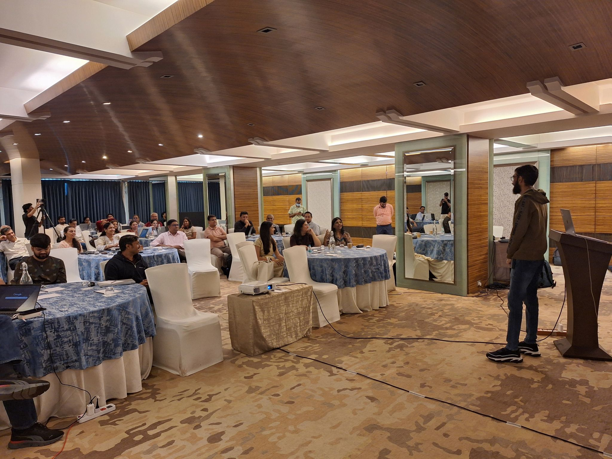

By the end of the first day, the attendees got familiar with all the core concepts of Frappe Framework, and in Day 2 we covered things like Frappe Cloud, Frappe Builder, Frappe Insights, and even agentic development!

We had ~45 participants with 20+ being from **IIT Bombay** (Frappe/ERPNext is going places!). This training was also recorded end to end and the recordings will be shared on our YouTube channels in the coming weeks. There were Accounting and Manufacturing bootcamps running in parallel, conducted by Baswaraj and Manan Shah respectively.

## Day 1: Stability & Polish

### State of the Frappeverse

Rushabh started with his classic "State of the Frappeverse". The highlights can be seen in the below slide:

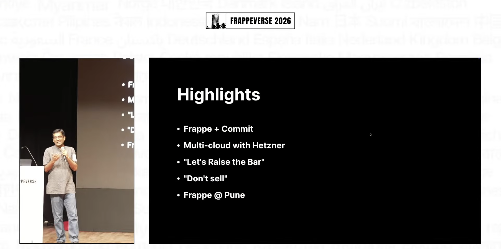

In general, they are growing fast: acquisition of The Commit Company, new office in Pune, multi-cloud on FC, and much more.

But then he quickly jumped on to address the elephant in the room: AI. He explained what has changed and how everyone at Frappe is now leveraging "agents":

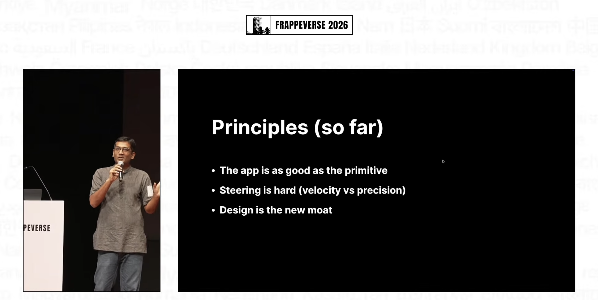

We also saw these principles in action with Frappe UI, Frappe Builder, and Studio the following day.

> The screenshots you see in this blog are taken from [Frappeverse 2026 livestreams](https://www.youtube.com/live/auqAl3Cbpck?si=WjWxtLftiwjbT7Lx) on YouTube.

### "Apple" of ERPs

This has to be *the* highlight for me. My friend Nikhil Kothari kicked-off Framework & ERPNext keynote by sharing his aspirations to become the "Apple" of ERPs:

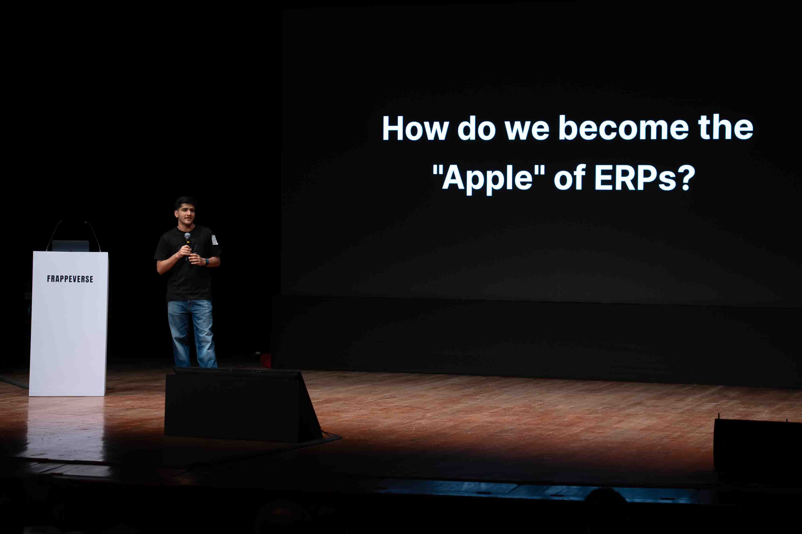

He mentioned how none of ERPNext's competitors inspire them and they have to chart their own path. He then discussed how they are planning to achieve this:

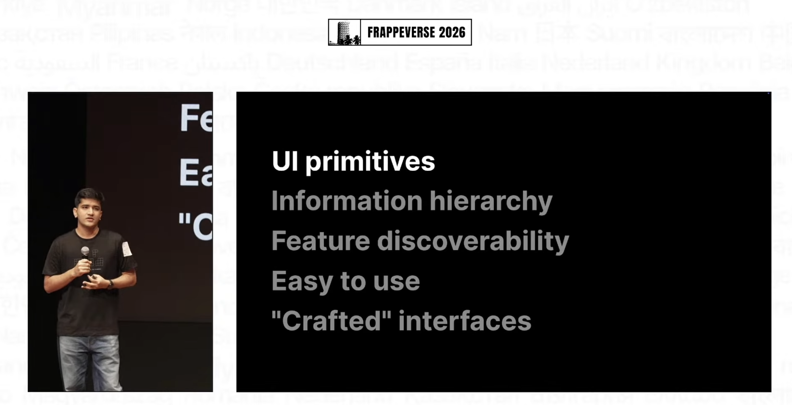

These are some fundamental principles of what great software is composed of. Nikhil has already started by bringing in Frappe UI like components to the desk interface (covered in [this video](https://youtu.be/87e9JzhFZzM?si=1ZahlJgqV21OvV5O&t=303)) and the following speakers from the team talked about how they are working on the other four areas. This can be seen in action in the latest polishes being shipped to Frappe/ERPNext: unified settings dialog (discovery), progressive disclosure in huge forms (information hierarchy), new banking module (crafted interfaces), and much more!

### Care

The attention to detail and the direction the team is on is very inspiring! I can see that they care about their craft. Care about their users. "Quality" is usually a very subjective thing to measure, but this time, up on that stage, I could see what quality looks like.

I am really looking forward to applying these at BWH in everything we do!

### Feature Highlights

In terms of features, my highlights would be the revamped Data Import tool and new Kanban, by Sumit!

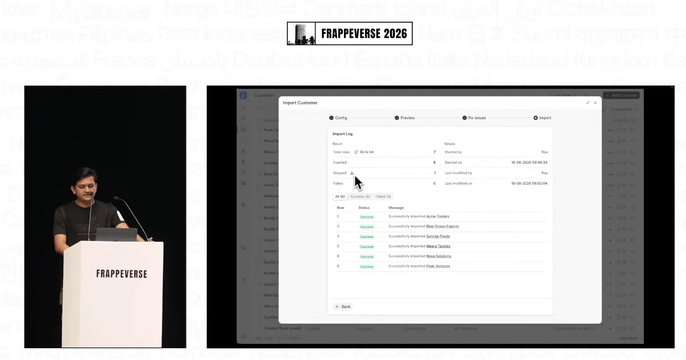

Data import experience is now top notch: tree mappings, fixing issues, smarter parser, and much more.

Finally, Kanban's performance issues are sorted! It now uses list virtualisation to keep the frontend experience smooth. It also got swim lanes, ability to configure cards per your liking (even icons and hover cards!), and more:

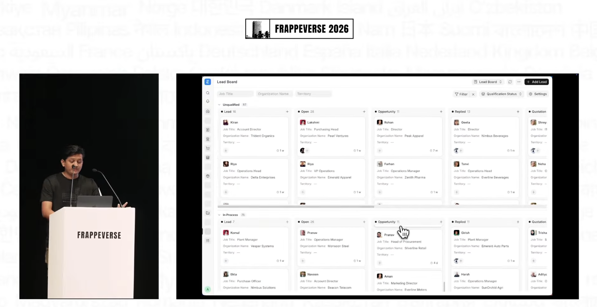

### Two types of companies in this world

I had heard this before, but this time it hit hard. Just like Nabin, I am also now very confident that ~~they~~ we will make ERPNext the best ERP in the world!

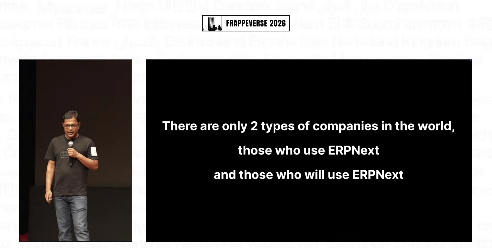

### Frappe Insights 🤝🏼 ERPNext!

It is finally happening! ERPNext's dashboards are now powered by Frappe Insights. The important thing to note here is it is not an iframe! **Fully interactive native embed of dashboards** created in Frappe Insights:

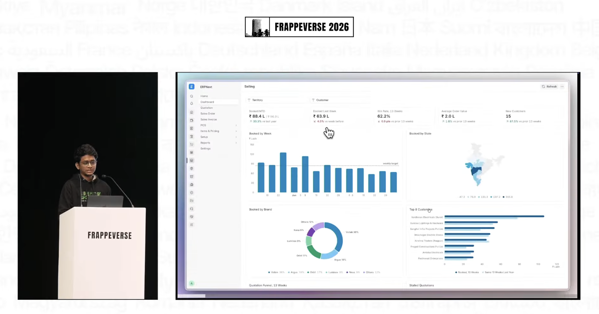

Saqib has already created a bunch of dashboards that will ship with ERPNext out of the box, but now you have the power to build and customise these dashboards from the amazing UX of Frappe Insights (BI tool by Frappe if you don't know). The new set of dashboards also includes a general Business Overview dashboard which is very useful for founders like me:

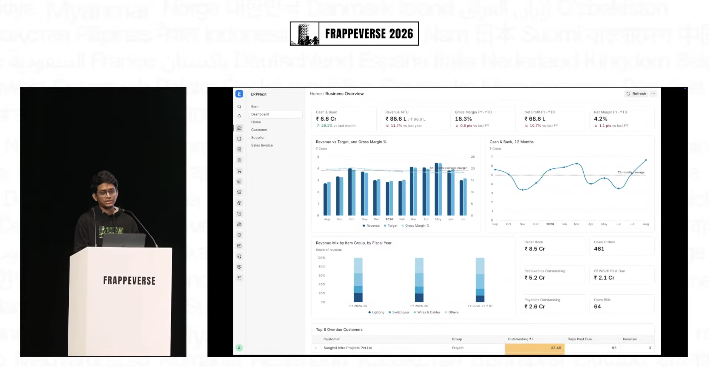

## Business Apps

There were also a lot of updates in business apps, here are some of my highlights:

* India Payroll in Frappe HR (with automatic TDS filing powered by the [Sandbox API](https://sandbox.co.in/tds) integration).
* `n8n` like no-code automation builder in Frappe CRM:
    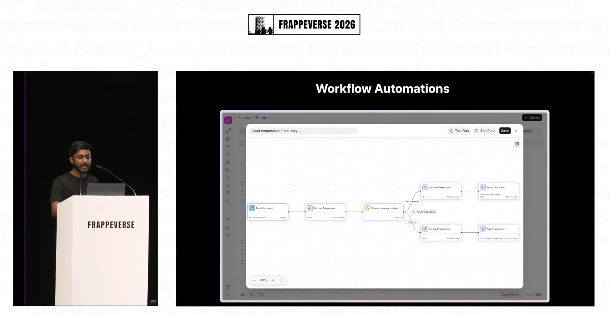
* Frappe CRM v2 in the works with support for custom DocTypes and forms in CRM dashboard.
* Frappe Helpdesk is more "crafted" now with polished design and features like the new ticket timeline view for agents:
    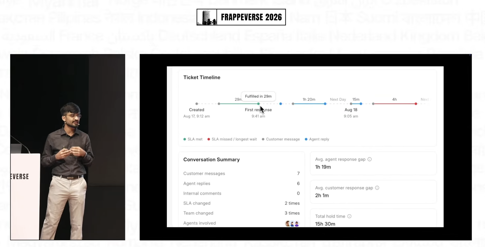

> BTW, next month we have a [Frappe CRM & Helpdesk Masterclass](https://buildwithhussain.com/school/batches/frappe-helpdesk-crm-masterclass) on BWH School.

### Raven v3 (beta)

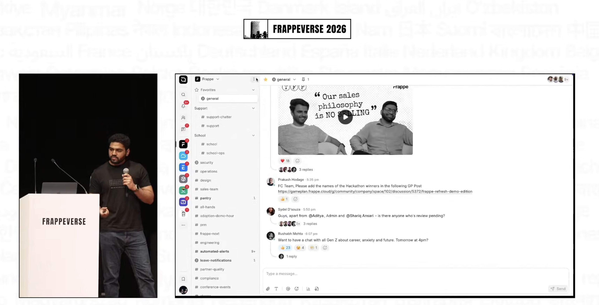

Delight. That is the right word to describe the new Raven (v3). The features are thoughtful and the User Experience is top notch. It is entering the league of legends like Linear and Notion!

Day 1 wrapped up with [a talk by yours truly](/blog/tutorial/automating-stuff-with-donna/), Frappe Awards, and a very nice music show by Megha Rawoot Live!

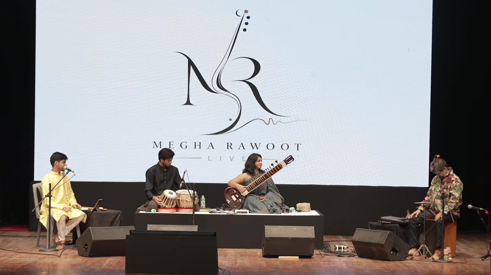

## Day 2: Experimentation & Cool things

If Day 1 was about stability and polish in already established products like Frappe Framework and ERPNext, Day 2 was all about the experimental products like the Frappe Suite and Frappe Cloud's next iteration. There was also a lot of LLM related stuff.

### Frappe Cloud v2

Aditya (Founder, Frappe Cloud) started by explaining the current scale of Frappe Cloud and the problems that come with it:

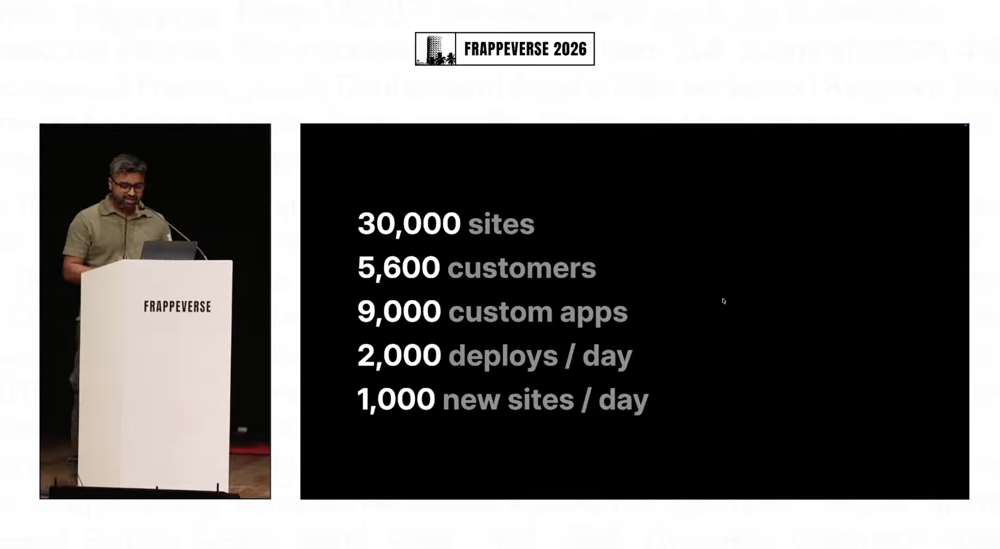

Then he went on to explain why it needed a ground-up rewrite and the principles behind it:

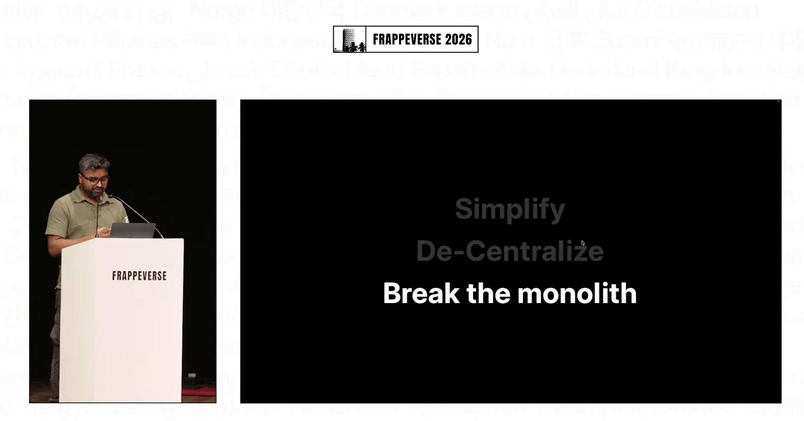

With LLMs now in picture, he says, they could finally do it, and do it fast. And they did exactly that! They built Frappe Cloud v2 during the agentic hackathon month at Frappe (and based on the Raven screenshot added earlier I assume they *won* it 🙈). Frappe Cloud v2 is composed of multiple pieces that work together:

1. Pilot
2. Atlas
3. Central

All Frappe specific features like apps, sites, marketplace, dev tools, etc. are now part of `Pilot`. Pilot is the new server manager tool that is going to replace `bench` (`bench` is officially archived!).

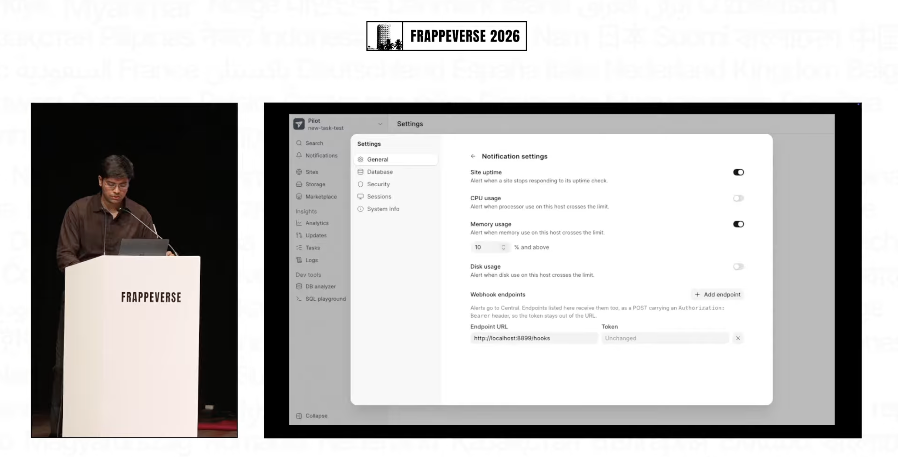

The features that used to be FC specific like automated backups, nice UI dashboard to manage deployments, SSL, WAF, and more are now available to anyone who is self-hosting too. Just think about it, a company which depends on Cloud to make money, bringing all the same features to self-hosted users. Hats off to Frappe team!

Instead of sites, benches, etc., Frappe Cloud v2 has only 1 primitive: VMs. `Atlas` is responsible for this. The users of Frappe Cloud will now be able to buy VMs and do whatever they want, a.k.a. General purpose cloud! You can either spin up these pre-baked VMs with Pilot (for hosting Frappe apps) or get plain VMs like Ubuntu to host anything you want.

`Central` is the glue that brings it all together, it will replace the Frappe Cloud dashboard: billing, IAM, creation and management of resources, and more:

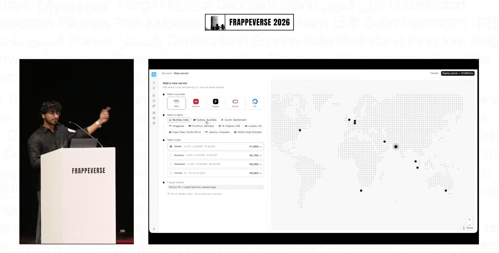

As you can see, Frappe also offers their own "compute" now! Of course, everything is still 100% open-source. Cloud v2 is expected to be released in Jan '27. I will do a video dedicated to this once it is a bit stable.

### Frappe Suite

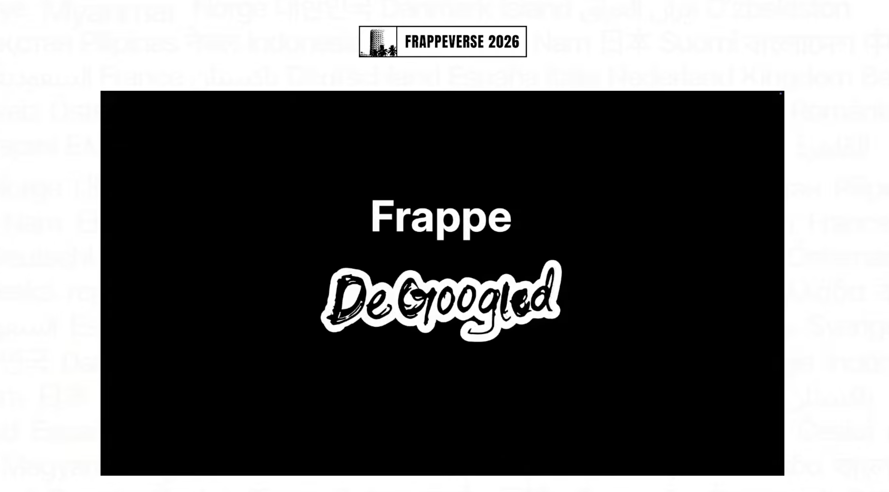

I am still surprised that Frappe is attempting this. There are only a few brave ones to try to build their own Office suite replacement. But now I can see everything coming together, I mean literally too, they have merged all the Suite apps in a mono-repo: [`frappe/suite`](https://github.com/frappe/suite). Right now it contains these 7 applications:

* Mail
* Calendar
* Meet
* Slides
* Drive
* Writer
* Sheets (built by Asif Mulani, a non-developer during the agentic hackathon month)

Then the developers of the respective apps showcased their work. I really liked the updates in Frappe Meet by Suhail. Frappe Meet is now very polished and feature-rich: 

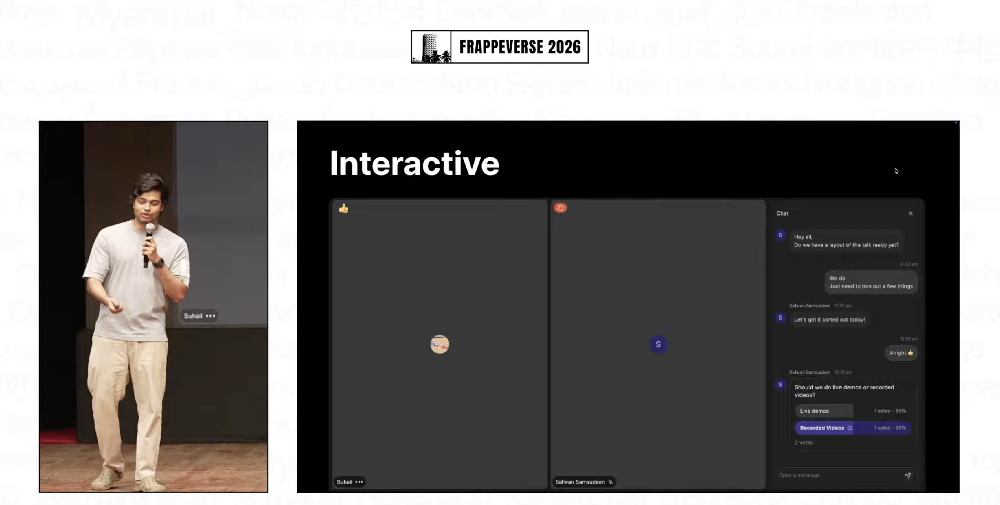

It now has live captions, noise cancellation, auto-framing, moderation, polls, end to end encryption, recordings, and more! Frappe themselves have moved off Gmail to Frappe Mail for few months now.

Faris wrapped up the Frappe Suite keynote by demoing what the future of **Suite** will look like:

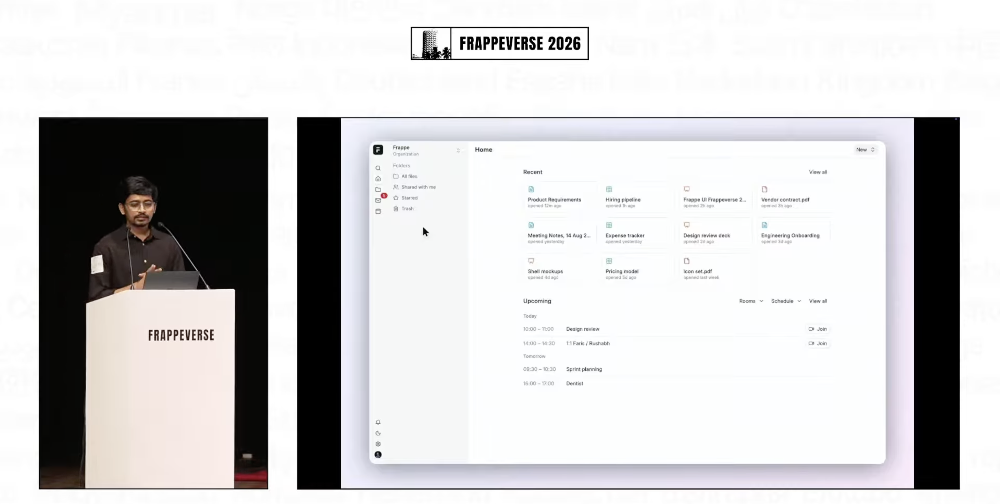

### Frappe UI

After a break, Faris was back on stage to show his work on Frappe UI v1. He explained how Frappe UI has evolved with learnings from v0 being used in dozens of apps at Frappe. The Espresso Design System has become better and more polished.

He spent some time explaining the role of LLMs in shipping of v1. How he used agents to audit multiple apps at once for usage of Frappe UI, look at common ground between components, increase the test coverage (by a LOT!), and to ship at lightning speed! To maintain quality, the biggest unlock he mentioned was setting up a `PHILOSOPHY.md` that defines principles of great UI components according to him.

He demoed an agent building a UI screen with and without Frappe UI:

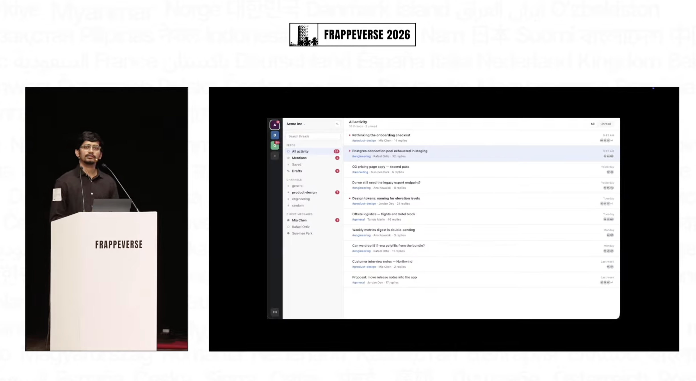

Then he just added "using frappe-ui" to the prompt:

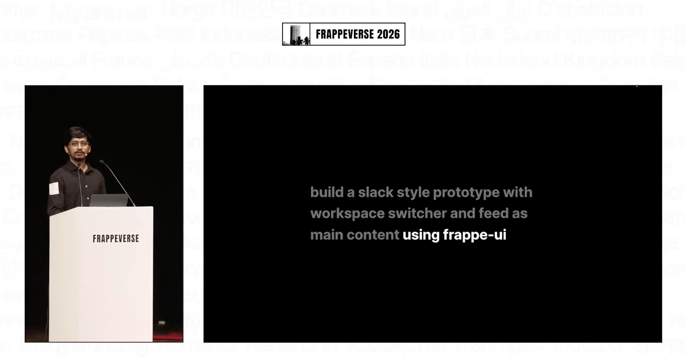

The result was a much slicker and consistent interface:

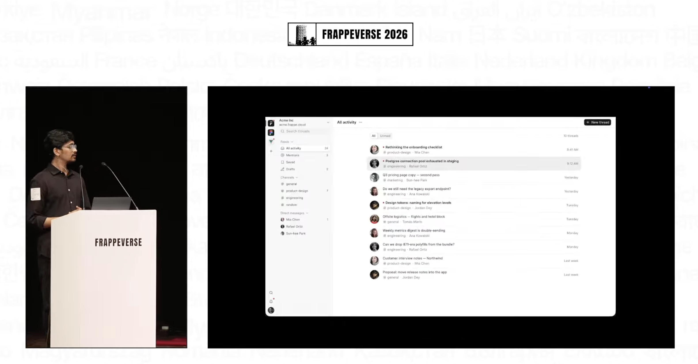

Amazing. This is why solid primitives matter when working with LLM agents, a common theme we saw multiple times. Combined with the official Frappe UI skill file, it can help you kick-start premium looking UI designs with less time and tokens.

### Frappe Builder & Studio 

Next came the Visual Builders. Both of them raised the same question: *"Are visual builders still relevant?"*

The answer is yes. Because of two things, agents can give you speed, but when you want to go the last mile: polish and tweak things, having a visual control gives you that power.

This time, both Frappe Builder & Frappe Studio got an AI agent: Builder's agent (harness) can build great looking websites, while Studio can spin up multi-page Frappe UI based apps in minutes! Frappe Builder also has a lot of starter templates now.

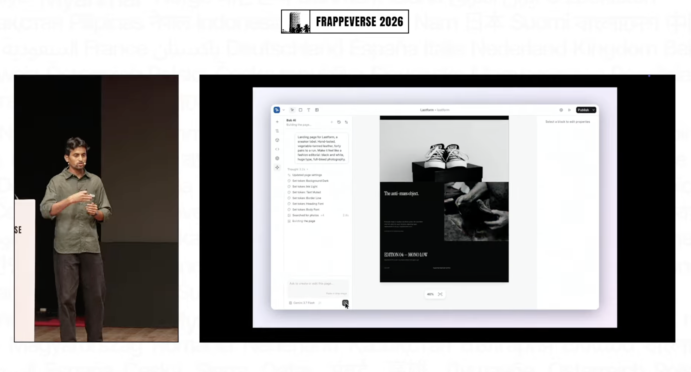

Suraj went a step ahead and showed how "Bob AI" agent can create DocTypes and wire forms on the fly!

Rucha's demo was also very exciting. The agent in Studio built a custom frontend for the Project management module in ERPNext:

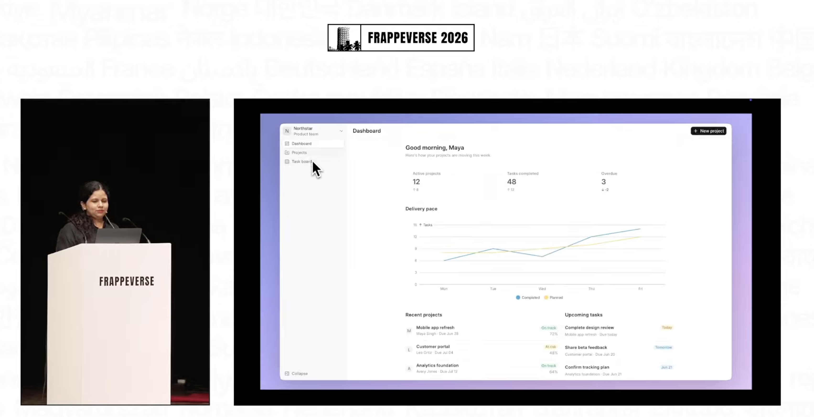

It used proper Frappe UI components like charts, lists, etc. to create slick frontends.

I think this is an interesting direction: prompt your own custom UIs or customize standard UI shipped with apps (like Frappe Helpdesk customer portal, that is being rebuilt on Frappe Studio). If done right, this will be even more flexible than the desk customisations!

### The Trivia

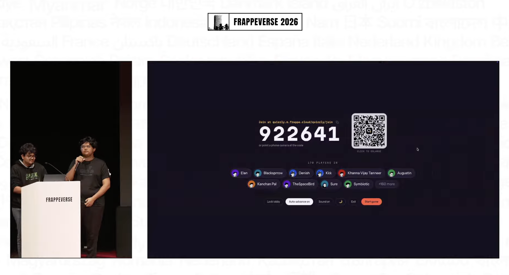

This was a highlight for me because the trivia (quiz) was run using [an open-source app](https://github.com/bwhtech/quizzly) built by Gajendra from our team. Earlier it was conducted using some proprietary software. I was a bit nervous, but it went very smooth, Gajendra had tested it very well.

Congratulations Vishwajeet from our team for being one of the winners, his general knowledge is good:

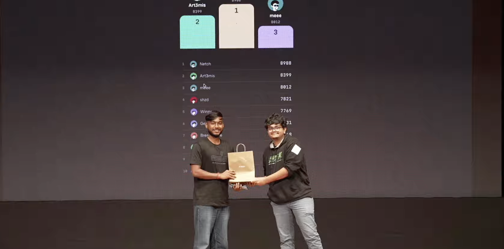

## The future is bright

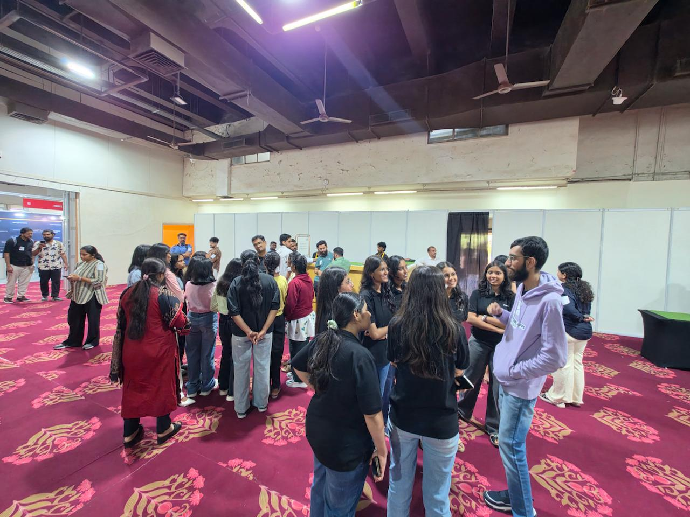

What do you see in the above image? Let me explain.

On one side you see Rushabh having a discussion with [CS17](https://cs17.org) students, and on the other me having a discussion with the students in the Frappe apprentice program. What a coincidence!

## Conclusion

Apart from this, there were a lot of interesting community sessions where members shared their experience solving problems with Frappe/ERPNext. I recommend skimming through the livestreams to watch talks that you might find interesting. Shivam and Rahul from our team also shared a story of one of our implementation failures and how we recovered from it!

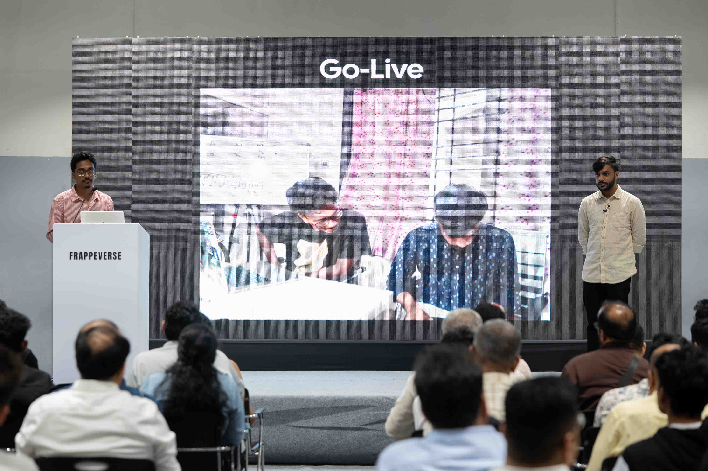

I have also recorded a vlog, which will be out later next month! 🤞🏼

Let me know your thoughts in the comments (on wherever this blog is posted).