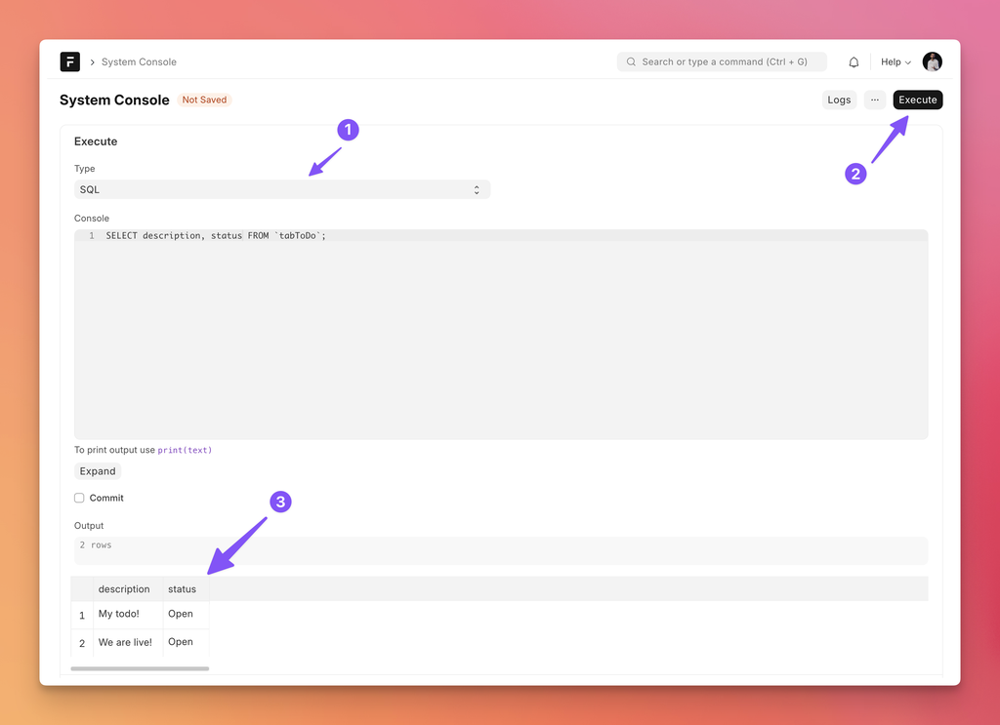
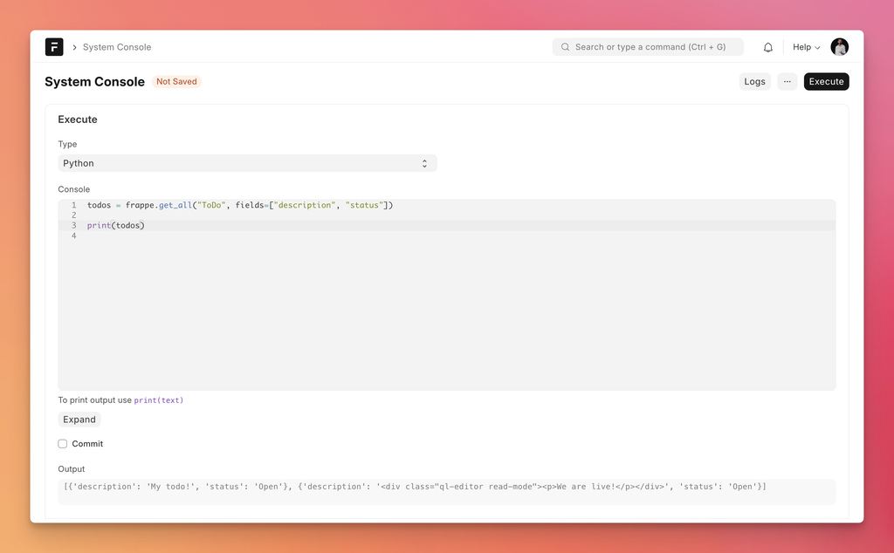
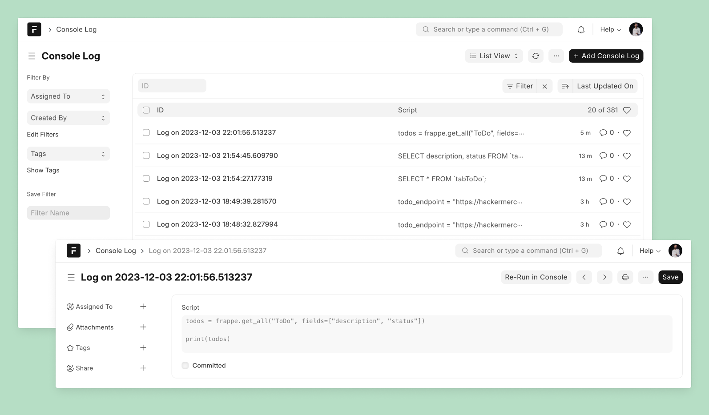
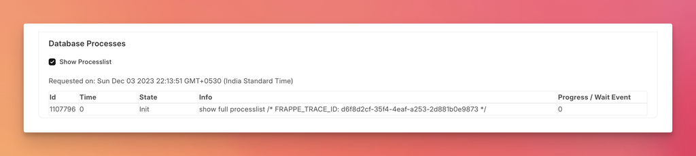

This article will be rather short. Hence, I am calling it a “mini article”!

I just wanted to share a quick tip for writing server scripts, script reports, and query reports which could save you a lot of time. Some of you might be already using it. But the answer is **System Console**!

## What is System Console?

System Console is like a shell to execute one-off scripts. You can write either a `SQL` statement or `Python` script, execute it, and it shows you the output right on this page.

You can use the awesome bar to search for “System Console”. Here is an example of running a SQL query:



For SQL queries, it renders a nicely formatted table with the output.

Here is an example of running a Python script:



As you can see, whatever you `print` ([used to be `log`](https://github.com/frappe/frappe/pull/23084)) will be shown as output below the script after execution. In the latest version of Frappe Framework, you can use  `print` inside Server Scripts and get nice debugging capabilities (more [here](https://github.com/frappe/frappe/pull/23084)).

### Commit 

If you keep the `Commit` checkbox unchecked, any changes your script makes to the database won’t be committed, so good for experimenting. You can enable `Commit` if you want to commit the changes your script makes (e.g. one-off scripts for fixing stuff, updating values in bulk, etc.).


## Console Logs

All the executions of System Console are saved. So, you can view history and reload them into console whenever required. Just click on the `Logs` button to view your console logs:




## Don’t Start in Script, Start in Console.

When I want to implement a new server script, I don’t start in the script itself, I start in System Console. Why? The short answer is **iteration speed**. Here is the long answer: It takes many fixes and tweaks before the script does what I intended it to do. And if I am directly writing code in a server script, for instance an API script, I have to call that endpoint to test it. Or in case of a Document event script, I have to trigger it by carrying out that event.

Same is true for writing [Query Reports](https://www.youtube.com/watch?v=9BT6zATsl1k). We might have to tweak the query a few times (specially in case of `JOIN`s) before it fetches the correct results.

You can write your Python Script in System Console first, get the logic working and then move it to Server Script document with necessary changes. 

Similarly you can write your SQL query and test it out in the System Console first and then copy-paste it into the Report form.

## Database Processes

System Console has yet another feature, you can view the database processes (nicely formatted) running on your site database by just checking the **Show Processlist** checkbox:



### Custom App Counterparts

When I am building custom apps, I use Python and MariaDB consoles instead:

```bash
# Python Console
$ bench --site site-name console [--autoreload]

# MariaDB
$ bench --site site-name mariadb
```


## Conclusion

This is all for this article, let me know if such “mini” articles are helpful, will try to do more of these.
