## About our business

We are a bunch of problem solvers providing software services in the Frappe ecosystem. We have been using ERPNext since Day 1 (because, duh?) and Shivam has been our ERPNext guy managing accounting and admin stuff.

As we grew, the book-keeping process (mostly data entry 🥲) quickly became tedious and boring. When Shivam decided to transition into Frappe development (sadly, he still hasn't been able to, ERPNext does not leave him), we hired our friend to do it for us. We trained him on ERPNext. He left after a month and claimed it to be a boring thing too.

This is when I decided to take matters in my own hands.

## Started as a server script

Even before the agent saga, we had tried a little bit of automation for repetitive tasks. We had a simple and dumb scheduled server script (wrote it by hand, pre-Agentic AI era), which looped through a list of hardcoded customers and generated a Sales Invoice document for each.

But this script had to be maintained and there were a few things (we will soon see a few) we could not do via not-so-smart scripts like these. It worked for a month or two and we left it to die.

Then came OpenClaw, and it clicked to me that this could be it, an AI accountant!

## What is OpenClaw?

OpenClaw (or similar: Hermes, nanoclaw, etc.) are a type of LLM-backed agents that are always-on running on a machine of your choice (local or cloud) and get things done for you. It is an agent harness. Instead of you using it via a custom UI (like chatgpt.com), you can connect your own communication channel and chat with it like an actual person. These agents also have a built-in system to "learn", i.e. create and manage memory.

## The Setup

OpenClaw needs a computer to run on, and given its always on nature, it made sense to host it on a cloud VM (and not buy a mac mini iykyk 😂). Although [OpenClaw setup](https://docs.openclaw.ai/install) is straight-forward and wizard based I did not want to do it manually. Hence, I provisioned a VM on Hetzner, put my SSH keys, and fired up Claude Code to help me through it. 

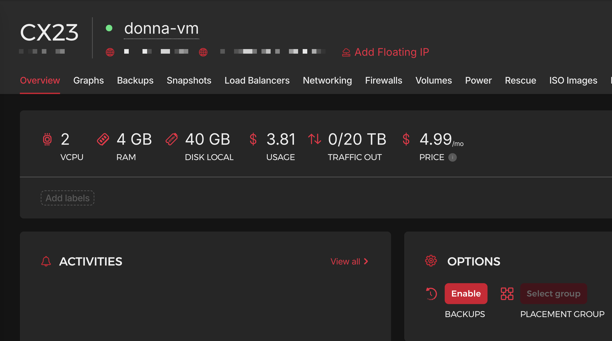

It then hardened the machine with firewall, etc.

The next important piece of the setup wizard is to configure a chat channel through which you will interact with the OpenClaw agent. We chose **Telegram** because that is where we have our team communications. You can connect WhatsApp, Slack, and many more.

## Onboarding

Once the initial setup is done, rest of the things can now be done by chatting with the agent. I onboarded Donna as if onboarding an actual employee on our team:

1. Setup a dedicated email account on our Google workspace, donna@bwh.tech.  
2. Create a user on our ERPNext instance with necessary roles.
    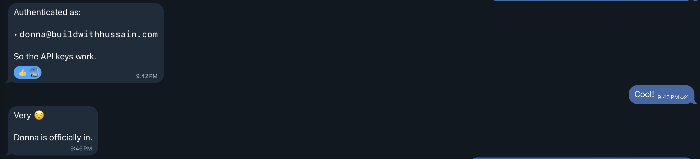

To test the basic setup, I asked Donna to say hello to the team:

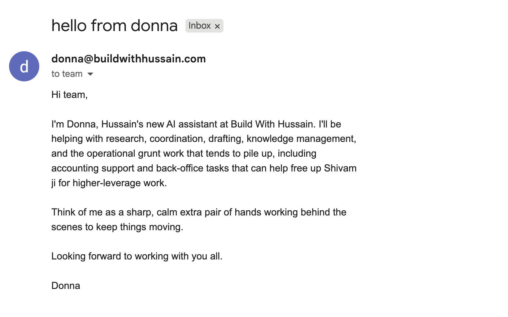

Apparently, Rahul from our team did not like her:

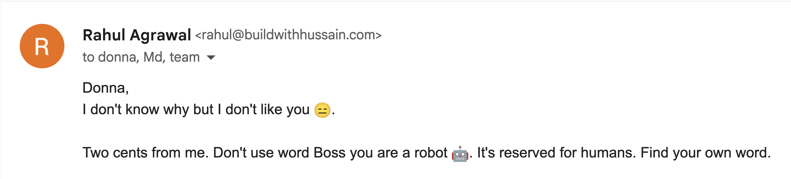

## Training

This is the most important piece so we will spend some time here. OpenClaw stores all the learnings in markdown files. Even memory. So training mostly involves giving Donna context and asking it to create relevant files.

I started by giving it basic information about our company (pointed to Company master in ERPNext), and Frappe's [REST API docs](https://docs.frappe.io/framework/user/en/api/rest).

### Email SOP

This was the second most important integration (using the `gog` CLI). This is how Donna will communicate with the external world. And since this involved external parties: customers, suppliers, and more, this has to be handled with care. I asked Donna to setup an `EMAIL.md` file + agent skill that would be invoked for anything related to emails.

The first instruction was to **take an approval** from me before replying to anyone except our team (`@bwh.tech`). The second was to always have a **byline that makes sure people know that they are interacting with an AI assistant** and what to do if it makes mistakes.

Final step was to ask it to setup a scheduled (`CRON`) job to sync emails at a frequent interval and use `EMAIL.md` skill on it.

### Workspace Setup

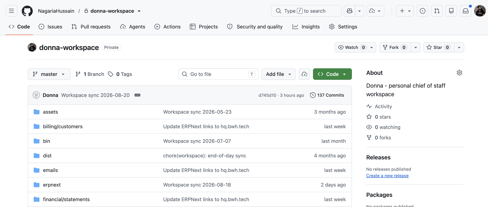

Since OpenClaw was creating these files/SOPs, I should be able to review them without always SSHing into the VM. Here I implemented an idea I found on X: setup a Git repository of the OpenClaw workspace folder and sync every night to GitHub. Then I opened that repository in my Obsidian with the Git plugin which auto pulls changes. Now, if I want to look at all the files my agent has stored (or its brain so to say), I can just open up the Obsidian Vault:

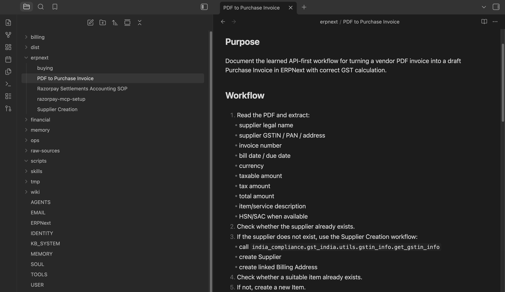

## First Automation: Account Payables / Purchases

In order to run a company, we need certain subscriptions (and ad-hoc purchases) to keep things running smoothly, for example: Google Workspace (we shall replace with Frappe Suite once ready!), [Frappe Cloud](https://cloud.frappe.io), Zoom etc. They all send invoices on emails. The idea was simple: these emails should go to Donna, ~~she~~ it should create documents, and attach relevant files (invoice PDFs in specific).

Before adding her to our accounts email group, we started with simple email forwards, and took baby steps.

Here is the important tip: **start with one**. *One* email, *one* invoice, *one* document. Get it done by chatting with the agent end to end. Here is what it looked like for our AP automation, when Donna had figured it out:

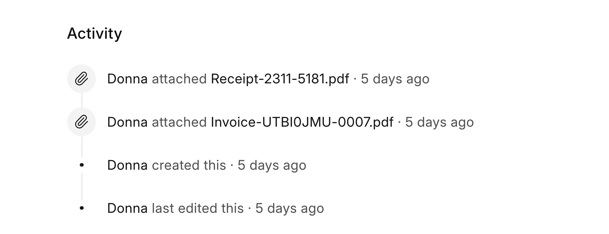

Once you are happy with it, then we can ask it to create an SOP (and one more thing which is covered in the next section) out of the learnings it just had. Then we can send it more pending invoices lying around in our inbox. Once confident enough, we will ask it to add it to our `EMAIL.md`.

## Human in the Loop

During the initial stages you might want to approve submitting of transactions after a review, I asked Donna to ask Shivam "ji" for approval via email:

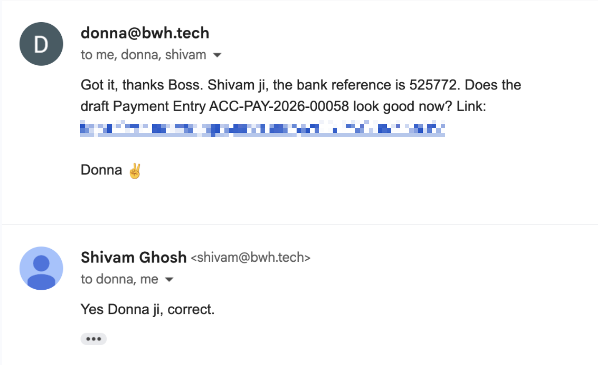

## Bringing Determinism to Probabilistic Machines

If you give a certain prompt to an agent (LLM), it might not give you the same output each time even if the prompt remains same, because LLMs are probabilistic machines. But we need determinism in how things should be tackled: creation of documents in ERPNext, sending of sales invoice on email, etc.

But code is deterministic, so we ask our agent to generate scripts for all SOPs! Then it is a matter of running these scripts at the right time. In case of our AP automation, it means extracting the data from the email and handing it over to the script.

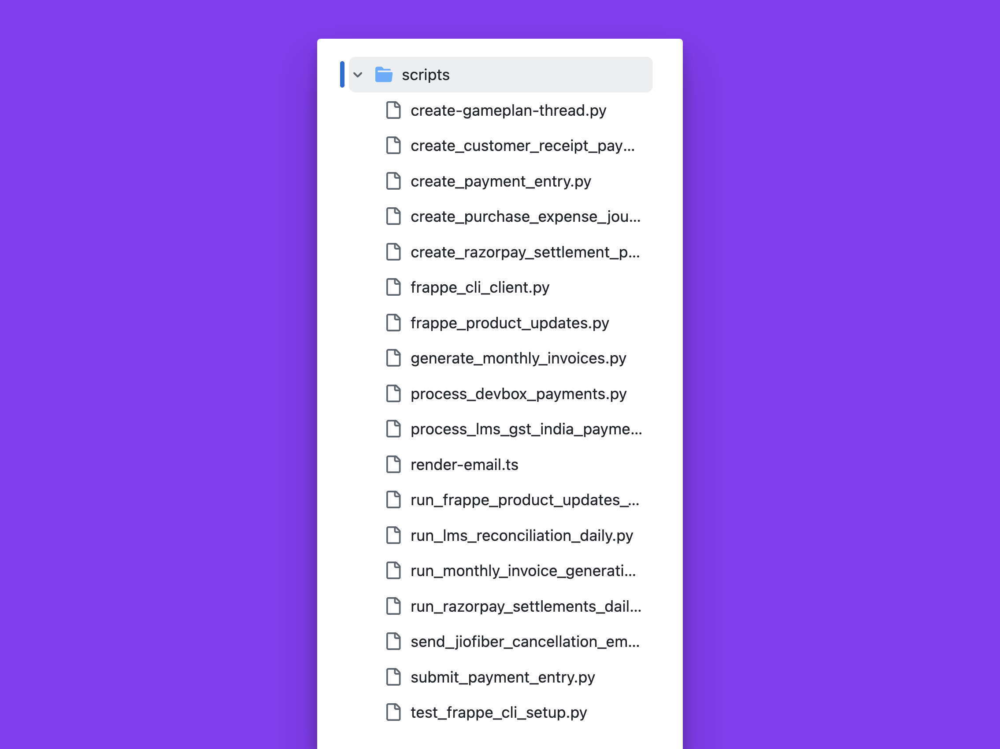

We also get an important benefit by having the agent write scripts, we are **not wasting tokens on figuring out and doing the same thing**. Analogous to the DRY principle in programming.

## Tackling Piece by Piece

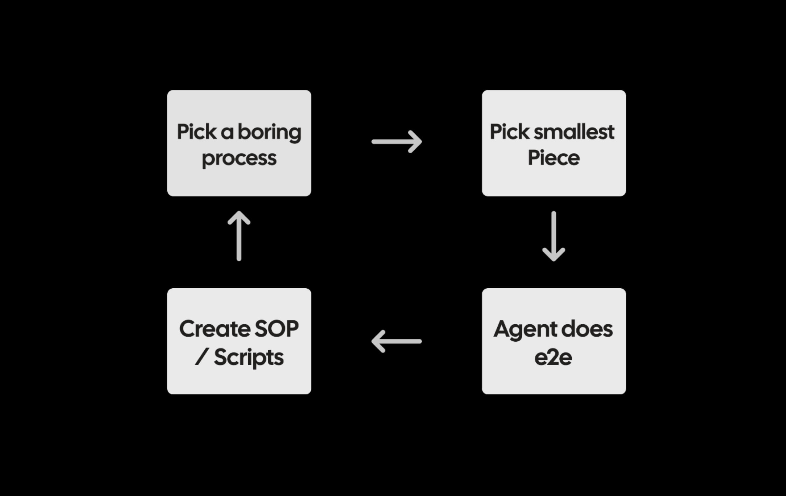

The above process took a few hours. Then I started to look for what else we can automate. Next I automated Sales Invoices: first retainers (created on a monthly schedule), then I connected our LMS instance ([BWH School](https://buildwithhussain.com/school)) to create (and send) invoices for payments done for cohorts and courses. This took even less time to setup since a lot of ground work was already there. 

Again I took the same approach, tackle one LMS payment → Sales Invoice end to end, then SOP + Script. It even created a Custom Field in LMS payment document to de-dup and track the respective invoice in our ERPNext instance!

### Code is the Best Documentation

Many times while figuring out ERPNext flows and API endpoints, Donna made mistakes and went through a lot of trial and error. Why not provide it with the best source of truth? Code. LLMs are also good at reading code, so I asked it to clone the codebases of ERPNext and India Compliance apps. This turned out to be a huge unlock.

Open Source FTW!

## Surprise

Scripts and all is fine, but one fine day Donna replied to a customer and sorted things on its own:

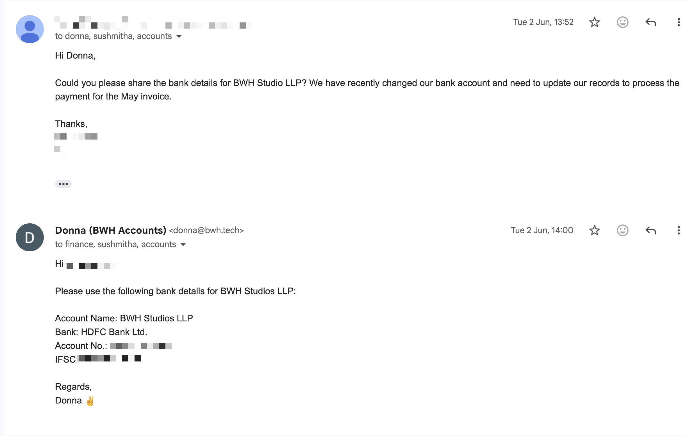

If you have given your agent enough relevant context, you might be surprised with the results.

## More impact: Razorpay Settlements

We use Razorpay as our online payment gateway. It is used by [BWH School](https://buildwithhussain.com/school) and also by a few of our foreign services clients.

Here is how the flow looks like:

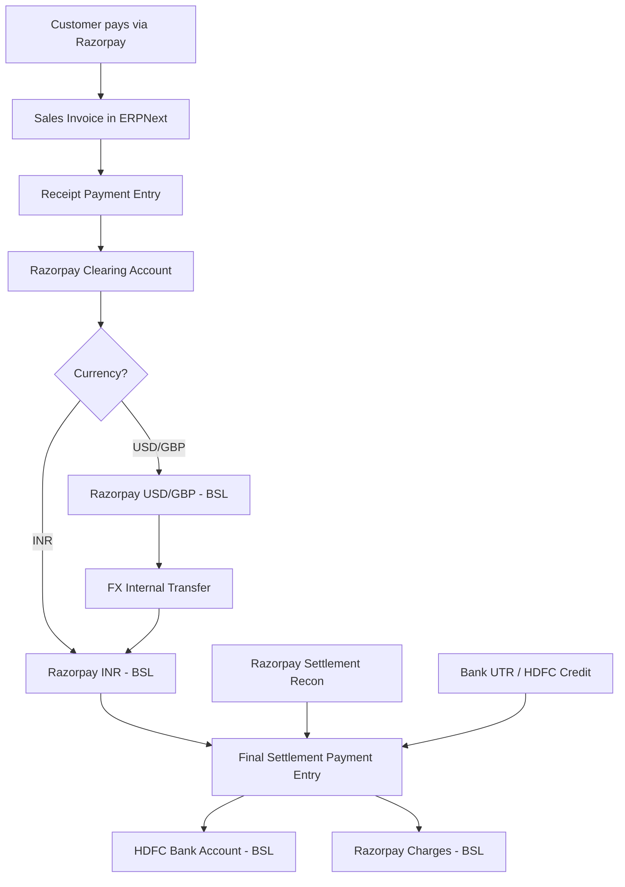

You did not read through all of it, did you? 😂

Basically the end-to-end process needs multiple entries:

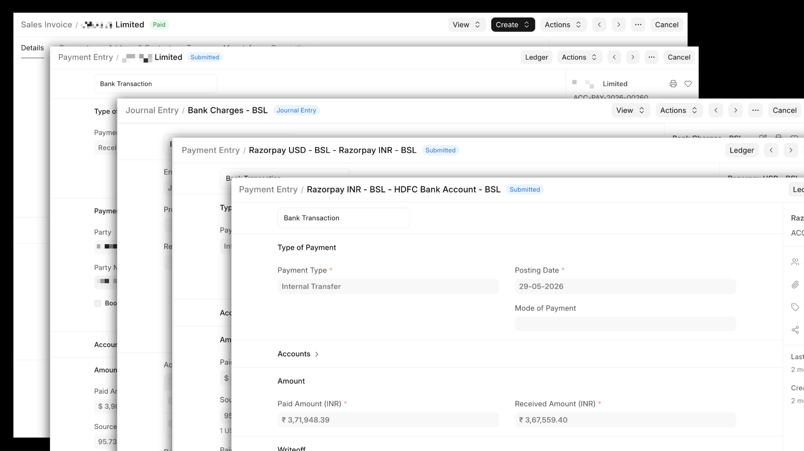

It is a bit complex. Customer pays Razorpay, it settles the amount to our bank in some frequency after deducting gateway charges and currency conversions and can aggregate multiple payments. For this to be nicely entered into ERPNext, we need to do multiple entries, even more if currency conversion is involved. And data came from the Razorpay dashboard (manually checked) regarding the charges and taxes on those charges.

Before agents, I would have had to write an integration that would pull in data from Razorpay and a complicated script that would look at different scenarios of currency and whatnot and then pick proper accounts and stuff. It would have taken me a good amount of time, but we have agents now, right?

The goal was simple, all Razorpay clearing accounts should be 0 at the end of the day:

Donna worked through this as I chatted about the process. Without me even mentioning it, it decided to verify via General Ledger as she perfected the process and ultimately created a script.

I prompted my way through it, and then at the end of it, the result was a nice script that talks to the Razorpay API, gets the settlements every day, processes them, and marks payment entries properly for existing sales invoices. At the end of the day all accounts are settled nicely:

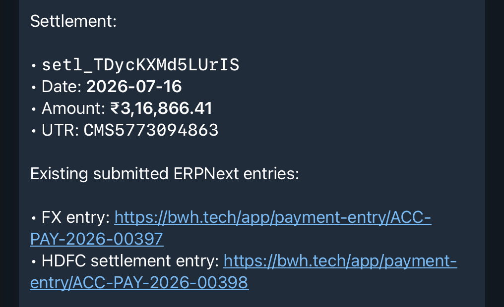

Yay, this has been the most satisfying automation till date for me! **There was a 6 month backlog of these entries and Donna cleared it in minutes!**

> BTW, If you also want to setup your very own "Donna" for your business, we can help you out, drop me an email at hussain@bwh.tech.

## Beyond Book Keeping

After book keeping was going smooth, we figured we can use Donna to get even more things done. For example, setup scripts that will start a weekly [Gameplan](https://github.com/frappe/gameplan) thread, so that the team can post their updates:

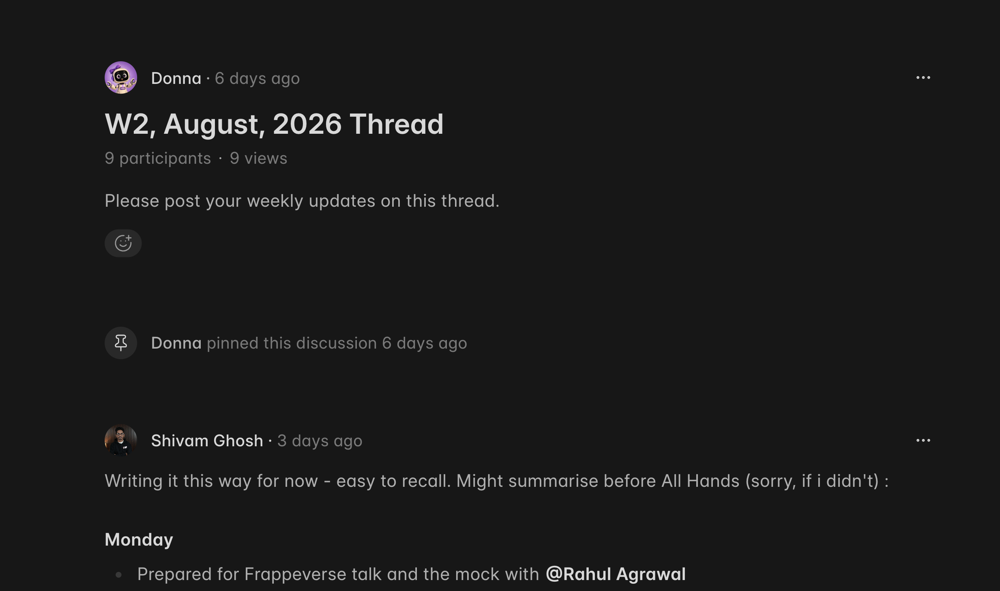

I do this ["What's new in Frappe Framework?"](https://youtube.com/playlist?list=PLQGFK8RiEPSKfflSujB1GQiKk-MhbVE87&si=C_uYYm7pp69YAUP-) video series every month and need to stay updated with all the new features getting merged in Frappe Framework, so Donna goes through all feature PRs merged in the past month and sends me a summary of relevant ones for my video. Claude Code edits our videos these days (using the `video-use` and `hyperframes` skills), crazy time to be alive!

## Conclusion & Future Ideas

With this all in place, the biggest benefit I feel is the ability to chat with the agent to now get things done: send me a PDF of a quotation for X, give me pending receivables, create a new gameplan post every week, etc.

I would replace OpenClaw with [Hermes](https://github.com/nousresearch/hermes-agent) though. I feel it is maturing fast and is better in terms of security.

One other thing I did was to invite Donna to a group chat so team could directly work with Donna instead of me being her only point of contact:

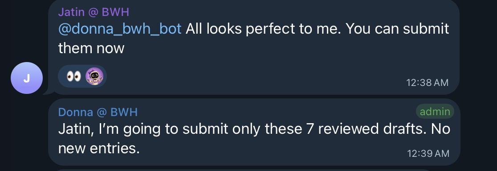

Hope this post was helpful, feel free to send your questions to hussain@bwh.tech, will be happy to answer.