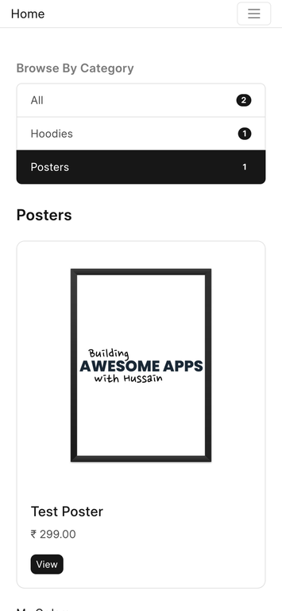

Ever since the [last episode](https://www.youtube.com/live/3jRGGH7f7tg?si=LFzX5iDUY9M6M6H3) of [Building an Online Merch Store on Frappe Framework series](https://youtube.com/playlist?list=PLQGFK8RiEPSK0P937uDN2_Xl3nrGKoKhb&si=ny72WuGy6bIcSU1Z) ended, I have been working on fixing issues and shipping more essentials features [behind the scenes](https://github.com/NagariaHussain/printrov_merch_store/issues?q=is:issue+is:closed). This article is a result of shipping the [browse by category feature](https://github.com/NagariaHussain/printrov_merch_store/issues/4) in our storefront:



You can try it out [here](https://HackerMerch.store).

## The Plan

I wanted a page with list (of links) of categories to be shown, which can be used by the user to only view products that belong to a particular category, for example, Hoodies. In other words, filter products by category.

## First Cut Implementation

I already knew I wanted to use Bootstrap's [List Group component](https://getbootstrap.com/docs/4.6/components/list-group/#links-and-buttons). So, I started by creating a new portal page `categories.html` (and its context file `categories.py`):

```html


	<div class="list-group">
	        <a href="/store" class="list-group-item list-group-item-action d-flex justify-content-between align-items-center">
	            All
	            <span class="badge badge-primary badge-pill">{{ categories_with_count.values()|sum }}</span>
	        </a>
	        
	            <a href="/store?category={{category}}" class="list-group-item list-group-item-action d-flex justify-content-between align-items-center">
	              {{ category }}
	              <span class="badge badge-primary badge-pill">{{ count }}</span>
	            </a>
	        
	</div>

```

Nothing fancy here, we loop over the `categories_with_count` dictionary and render a list group item for each of them. This dictionary is attached to the jinja context in `categories.py` file:

```py
import frappe

from collections import Counter

def get_context(context):
    product_categories = frappe.db.get_all(
        "Store Product", pluck="printrove_category",
        filters={"is_published": True}
    )

    context.categories_with_count = Counter(product_categories)
```

In the above code snippet, I get the categories of all the published store products, create a `Counter` (frequency dictionary) and attach it to the context, which is then used in the jinja template.

## The Change Of Plan

While implementing this page, I realised few things: 

1. It will be better UX if I added this categories list in the home page itself, above the products list
2. I want to reuse this list in multiple pages (like store home page, products page etc.)
3. I might need the categories by count data someplace else (probably to render a different UI somewhere)

Fixing the 3rd point is easy, extract out a (reusable) function that encapsulates the computing and return of categories with count, then the context code becomes:

```py
from printrov_merch_store.utils import get_categories_with_count

def get_context(context):
    context.categories_with_count = get_categories_with_count()
```

Solving the 1st and 2nd point will require us to learn about some *jinja techniques* (pun intended 😆)!

## Macros in Jinja

Macros in Jinja are analogous to functions. But in contrast to normal functions in Python, they contain HTML template inside their body, which is placed where these macros are called. Let's take a simple example of a macro:

```html

	<h2>Hello, {{ name }}!</h2>

```

As you can see, you can also define parameters for a macro, making it more flexible for reuse. Now you can use this macro just like you would call a function:

```html
{{ render_hello() }}
{{ render_hello("John") }}
```

The above snippet of template will get replaced by the below HTML after render:

```html
<h2>Hello, Stranger!</h2>
<h2>Hello, John!</h2>
```

With this knowledge, we can create a reusable macro for our categories list group component. I will create a new file inside the `templates/includes` (by convention) directory in my printrove integration custom app and add the below content:

```html


    <div class="list-group">
        <a href="/store" class="list-group-item list-group-item-action d-flex justify-content-between align-items-center {{ 'active' if (not active_category) else '' }}">
            All
            <span class="badge badge-primary badge-pill">{{ categories_with_count.values()|sum }}</span>
        </a>
        
            <a href="/store?category={{category}}" class="list-group-item list-group-item-action d-flex justify-content-between align-items-center {{ 'active' if category == active_category else '' }}">
              {{ category }}
              <span class="badge badge-primary badge-pill">{{ count }}</span>
            </a>
        
    </div>


```

The above macro takes the categories by count dictionary and an active category (to highlight it) as arguments and renders the category list. We can now import and use this macro in our categories page like this:

```html


<!-- Assuming `categories_with_count` is still in context -->
{{ categories_list_group(categories_with_count, "Hoodies") }}
```

But wait, I want to use this in home page as well, how do I do that? My concern here is with `categories_by_count` dictionary, I have to attach it to the context wherever I want to render the category list and pass it to the macro. **Wouldn't it be nice if we could just call the macro and it takes care of rendering the list group without we passing this data?**


## Extending Methods Using hooks.py

We can use the `jinja` hook in our hooks.py file to add methods (and filters, next section) to our jinja environment:

```py
jinja = {
    "methods": [
        "printrov_merch_store.utils.get_categories_with_count"
    ],
}
```

Here, I am providing a list of dotted paths to Python functions that I want to make available in my jinja templates. In this case, we are giving the path to our `get_categories_with_count` utility method. And done! Now, we can just improve our macro to use this method to get the data:

```html

    
...
```

Nice and encapsulated! Now, we can import the macro anywhere and it should just work.


## BONUS: Filters

Even though this feature didn't require the use of a custom filter, this can come handy in some cases.

Let's focus on this line from our categories list group macro:

```html
<span class="badge badge-primary badge-pill">{{ categories_with_count.values()|sum }}</span>
```


`categories_with_count.values()` returns all the counts and then we are applying a `sum` filter on it. `sum` is a built-in filter in Jinja that gives you the sum of iterable it is applied to. In this case, it will be the total count of all products.

There are other built-in filters like `unique`, `join`, `sort` and many more. You can read more in Jinja documentation [here](https://jinja.palletsprojects.com/en/3.1.x/templates/#filters).

One more thing, you can also chain multiple filters together:

```html
Users on this page: {{ users|map(attribute='username')|join(', ') }}
```

## Creating And Using Custom Jinja Filters in Frappe Framework

We can also create our own filters for use in our Jinja templates. From Jinja docs:

> "Filters are Python functions that take the value to the left of the filter as the first argument and produce a new value. Arguments passed to the filter are passed after the value."

Let's write a simple filter to understand it. I want to write a filter that returns 2x of the value it is applied to, for example:

```html
{{ 2|twice }}
```

should render 4. You can write filters (functions) anywhere in your custom app, it is the dotted path that will be used to add it to our jinja environment. I will place it in my utils file:

```py
def twice(value):
	return 2 * value
```

Now, we can use the jinja hook in our hooks.py file to add this filter to our environment:

```py
jinja = {
    "methods": [...],
    "filters": [
        "printrov_merch_store.utils.twice",
    ]
}
```

We should now be able to use this in our Jinja templates like this:

```html
{{ count|twice }}
```

A good use-case for custom filters is to have filters for formatting currency, date, etc. 

## Conclusion

That's it for this article: Macros, Methods and Filters! Keep these concepts in mind when you are working with templates next time 😉
